# UML Diagrams – Campus Trading Application
## Mermaid Code & Report Text

---

## Possible UML Diagrams (13 Total)

### UML Class Diagrams (7)
1. **Complete System Class Diagram** – All 14 entities, key attributes, and all relationships
2. **User Management Module** – Member & Administrator with generalization to abstract User
3. **Marketplace & Catalog Module** – Category (self-referencing), Listing, ListingImage (composition), WishRequest
4. **Trading Pipeline Module** – Offer, Transaction, Rating with Member and Listing context
5. **Communication Module** – MessageThread, Message (composition) with Offer, Listing, Member context
6. **Discovery & Engagement Module** – WishRequest, Watchlist (association class), Notification
7. **Moderation & Administration Module** – Report, Administrator with Member and Listing context

### UML State Machine Diagrams (6)
8. **Listing Lifecycle** – Listed → Pending → Reserved → Sold/Expired/Withdrawn
9. **Offer Lifecycle** – Submitted → Accepted/Declined/Withdrawn/Expired
10. **Transaction Lifecycle** – Scheduled → Completed/Cancelled
11. **WishRequest Lifecycle** – Active → Fulfilled/Expired/Cancelled
12. **Report Lifecycle** – Submitted → UnderReview → Resolved/Dismissed
13. **Member Account Lifecycle** – Active → Suspended/Deleted

---
---

## Diagram 1: Complete System UML Class Diagram

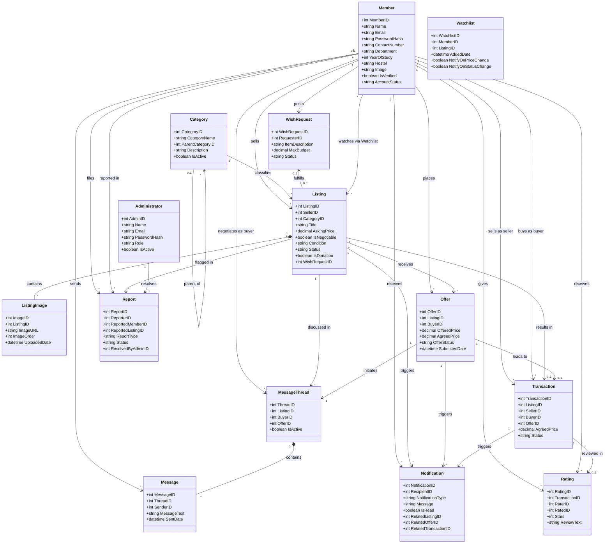

---

## Diagram 2: User Management Module (with Generalization)

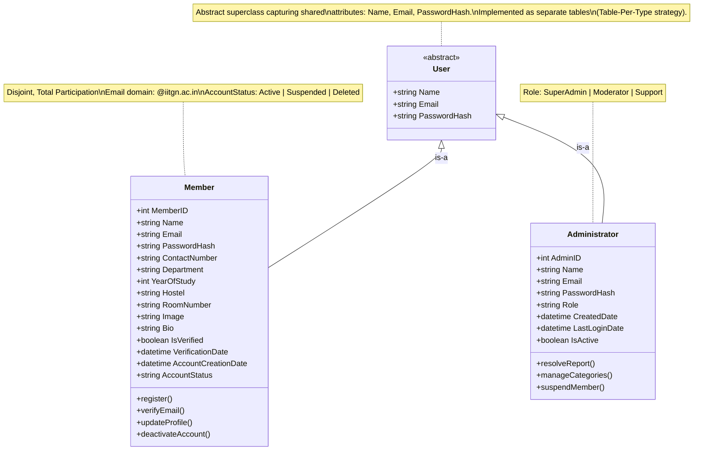

---

## Diagram 3: Marketplace & Catalog Module

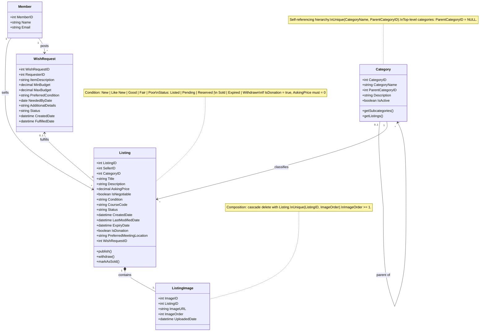

---

## Diagram 4: Trading Pipeline Module

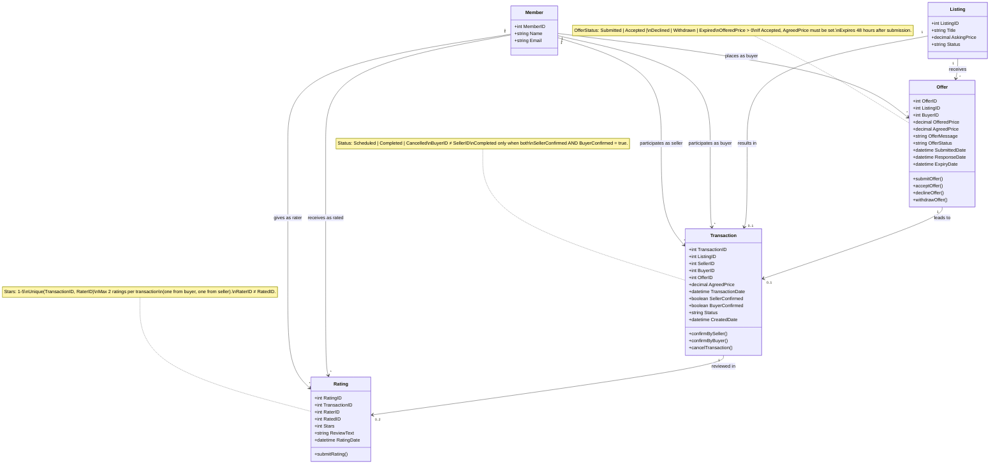

---

## Diagram 5: Communication Module

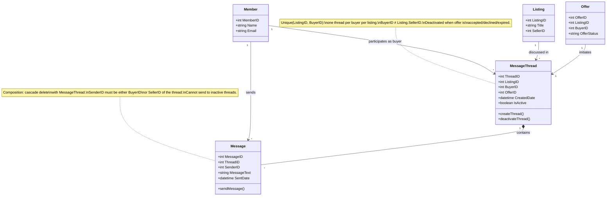

---

## Diagram 6: Discovery & Engagement Module

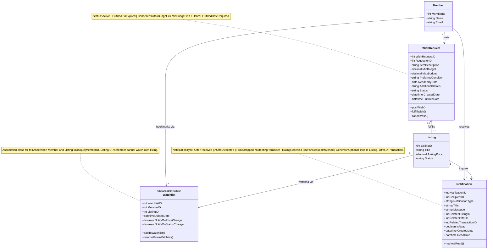

---

## Diagram 7: Moderation & Administration Module

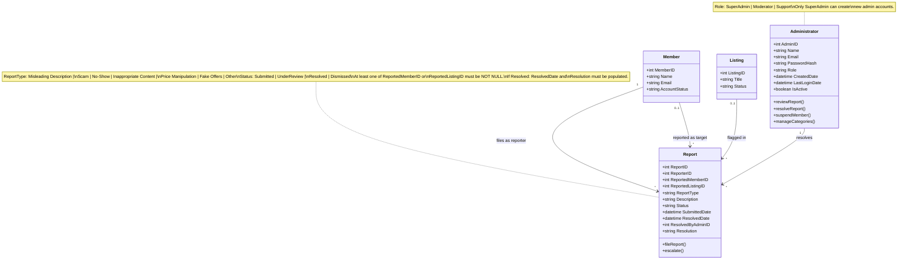

---

## Diagram 8: Listing Lifecycle (State Machine)

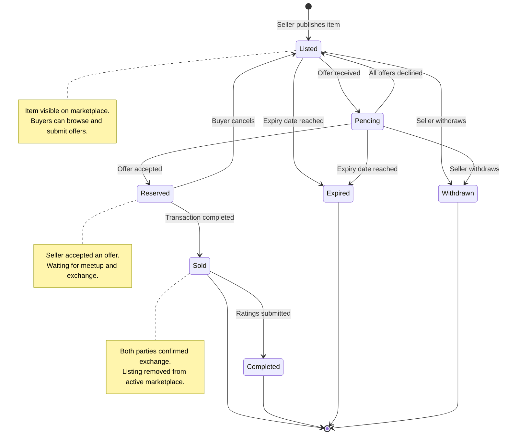

---

## Diagram 9: Offer Lifecycle (State Machine)

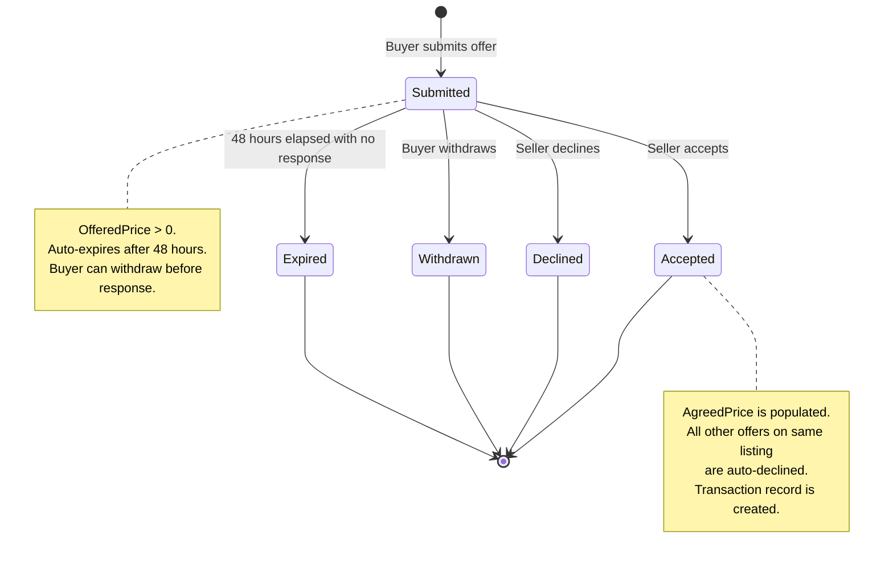

---

## Diagram 10: Transaction Lifecycle (State Machine)

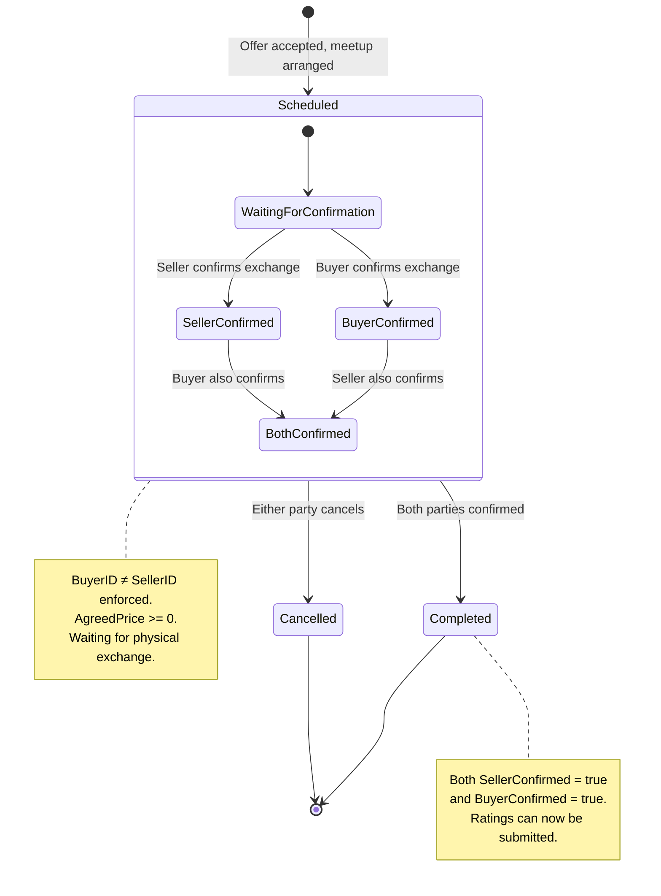

---

## Diagram 11: WishRequest Lifecycle (State Machine)

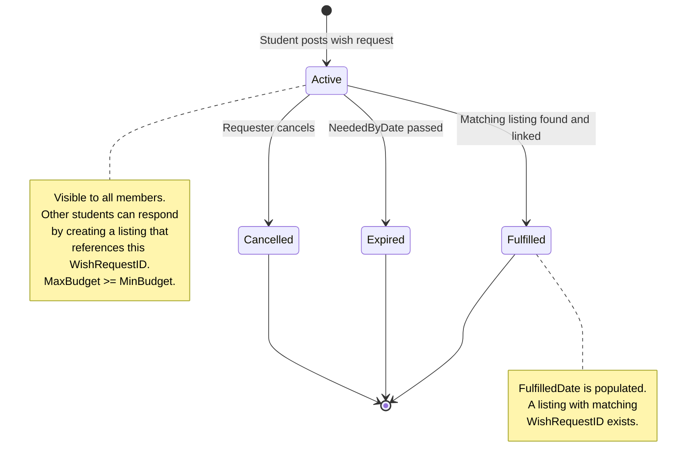

---

## Diagram 12: Report Lifecycle (State Machine)

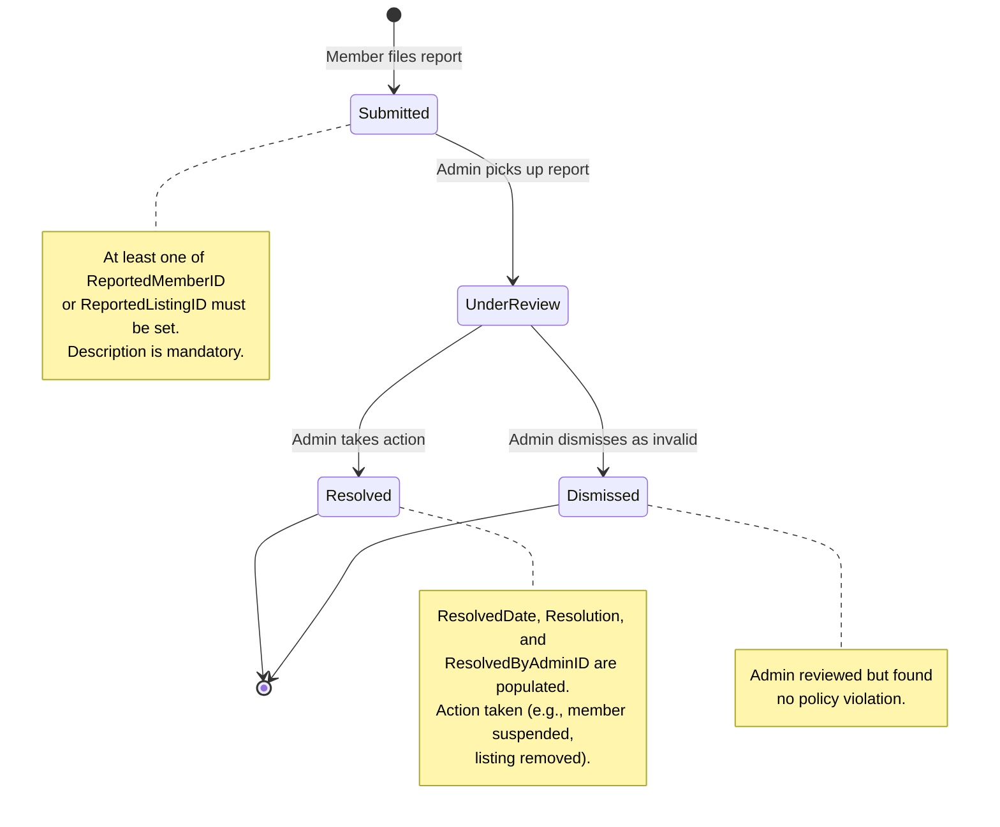

---

## Diagram 13: Member Account Lifecycle (State Machine)

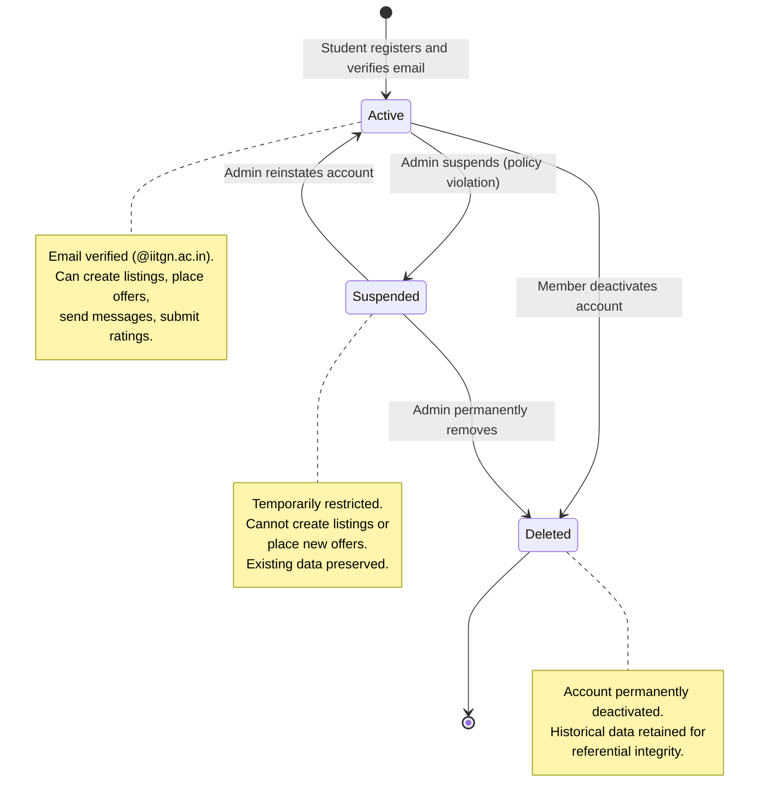

---
---

# REPORT TEXT: Module B – UML Diagrams Section

> Paste the following text into your report. Replace `[Figure X]` placeholders with the actual generated diagram images.

---

## Module B: Conceptual Design Using UML Diagrams

### B.1 Introduction

This section presents the conceptual design of the Campus Trading Application using Unified Modeling Language (UML) diagrams, following the notation and conventions described in Chapter 10 of *Fundamentals of Database Systems* by Ramez Elmasri and Shamkant B. Navathe. UML provides a high-level, implementation-independent view of the system's structure and behaviour, serving as the foundation for deriving the Entity-Relationship (ER) model and ultimately the relational schema implemented in Module A.

The Campus Trading Application is a campus-wide peer-to-peer marketplace designed for students of IIT Gandhinagar. The system enables verified students to list items for sale, negotiate prices through offers and messaging, complete transactions with mutual confirmation, and build reputation through post-trade ratings. The conceptual design captures 14 entity classes, 25+ associations, and multiple stateful workflows.

We present two categories of UML diagrams:
1. **UML Class Diagrams** (7 diagrams) – capturing entities, attributes, operations, and structural relationships including associations, composition, aggregation, and generalization.
2. **UML State Machine Diagrams** (6 diagrams) – capturing the lifecycle and state transitions of key entities with dynamic behaviour.

### B.2 UML Notation and Conventions

Following Elmasri and Navathe (Chapter 10), the UML class diagrams in this report use the following conventions:

- **Classes** are represented as rectangles divided into three compartments: class name (top), attributes (middle), and operations (bottom).
- **Attributes** are shown with visibility markers (`+` for public), data type, and attribute name.
- **Primary Keys** are the first attribute listed in each class (suffixed with `ID`).
- **Associations** are drawn as solid lines between classes, labelled with the role or association name.
- **Multiplicity** is denoted at each end of an association using UML notation: `1` (exactly one), `0..1` (zero or one), `*` (zero or more), `1..*` (one or more), `0..2` (zero to two).
- **Composition** (filled diamond ◆) indicates a whole-part relationship where the part cannot exist independently of the whole and is cascade-deleted when the whole is removed.
- **Aggregation** (hollow diamond ◇) indicates a whole-part relationship where the part can exist independently.
- **Generalization** (unfilled triangle △) indicates an inheritance (is-a) relationship between a superclass and subclasses.
- **Association Classes** are shown with a dashed line connecting the class to the association it describes (used for Watchlist as the M:N junction).
- **Stereotypes** (e.g., `<<abstract>>`, `<<association class>>`) are enclosed in guillemets above the class name.
- **Notes** attached to classes document key constraints and domain rules.

### B.3 UML Class Diagrams

#### B.3.1 Complete System Class Diagram

*[Figure 1: Complete System UML Class Diagram]*

The complete system class diagram provides a holistic view of all 14 entity classes and their interrelationships. The diagram reveals the Member class as the central entity, with direct associations to Listing (as seller), Offer (as buyer), Transaction (as seller and buyer), Rating (as rater and rated), WishRequest (as requester), Notification (as recipient), MessageThread (as buyer-participant), Message (as sender), and Report (as reporter and reported target). This star-like topology reflects the Member-centric design of the marketplace, where all activities originate from or are directed toward student users.

Key structural patterns visible in the diagram include:
- **Two composition relationships**: Listing–ListingImage and MessageThread–Message, where the part entities have no independent existence.
- **One many-to-many relationship**: Member–Listing via the Watchlist junction table.
- **Multiple role-based associations**: Member participates in Transaction as both seller and buyer, and in Rating as both rater and rated, demonstrating role-differentiated multiplicity.
- **A self-referencing association**: Category references itself via ParentCategoryID to model hierarchical product categorization.

#### B.3.2 User Management Module (with Generalization)

*[Figure 2: User Management UML Class Diagram]*

This diagram demonstrates UML generalization (inheritance) as described in Elmasri and Navathe, Section 10.3. An abstract superclass **User** captures the shared attributes common to all authenticated users of the system: Name, Email, and PasswordHash. Two concrete subclasses specialize this:

- **Member**: Represents verified student accounts with campus-specific attributes (Department, YearOfStudy, Hostel, RoomNumber) and behavioural methods for registration, email verification, and profile management.
- **Administrator**: Represents platform moderators and support staff with role-based access control (SuperAdmin, Moderator, Support) and administrative methods for report resolution, category management, and member suspension.

The generalization is **disjoint** (a user is either a Member or an Administrator, never both) and exhibits **total participation** (every authenticated user must belong to exactly one subclass). In the relational schema (Module A), this generalization is implemented using the **Table-Per-Type** strategy—separate tables for Member and Administrator—to optimize query performance for the distinct workflows each role performs.

#### B.3.3 Marketplace & Catalog Module

*[Figure 3: Marketplace & Catalog UML Class Diagram]*

This diagram captures the core marketplace structure:

- **Category** employs a self-referencing association (`parent of`) to model a hierarchical categorization tree (e.g., Electronics → Computing → Laptops). The unique constraint on (CategoryName, ParentCategoryID) ensures no duplicate category names within the same level.
- **Listing** is the central marketplace entity, associated with a seller (Member) and classified under a Category. It contains domain-specific attributes such as Condition, CourseCode (for textbooks), IsDonation flag, and PreferredMeetingLocation.
- **ListingImage** is in a **composition** relationship with Listing (filled diamond), meaning images are lifecycle-dependent on their parent listing—when a listing is deleted, all its images are cascade-deleted. The unique constraint on (ListingID, ImageOrder) ensures each image has a distinct display position.
- **WishRequest** models reverse-marketplace demand. The optional association between WishRequest and Listing (0..1 on both sides) captures the "I Have This" feature where a listing can be created specifically in response to a wish request.

#### B.3.4 Trading Pipeline Module

*[Figure 4: Trading Pipeline UML Class Diagram]*

This diagram models the core trading workflow:

- **Offer** captures buyer price proposals on listings. Key constraints include a 48-hour auto-expiry and the requirement that an accepted offer must populate AgreedPrice. The 1:* multiplicity from Listing to Offer indicates that a listing can receive multiple competing offers.
- **Transaction** records the outcome of accepted offers. It references both SellerID and BuyerID (with the constraint BuyerID ≠ SellerID) and implements a dual-confirmation protocol—the Status transitions to Completed only when both SellerConfirmed and BuyerConfirmed are true.
- **Rating** enables post-transaction reputation building. The 1:0..2 multiplicity from Transaction to Rating restricts each transaction to at most two ratings (one from the buyer, one from the seller). The unique constraint on (TransactionID, RaterID) and the check RaterID ≠ RatedID enforce this rule.

The pipeline flow is: Listing → Offer → Transaction → Rating, representing the complete lifecycle of a trade from listing to reputation feedback.

#### B.3.5 Communication Module

*[Figure 5: Communication UML Class Diagram]*

This diagram captures the negotiation messaging subsystem:

- **MessageThread** represents a conversation channel between a specific buyer and seller for a particular listing. Each thread is initiated by an Offer (1:1 association). The unique constraint on (ListingID, BuyerID) ensures exactly one thread per buyer-listing pair.
- **Message** is in a **composition** relationship with MessageThread—messages are cascade-deleted when their thread is removed. The SenderID must be either the BuyerID or the seller of the associated listing, preventing third-party messages.

Thread lifecycle is tied to offer state: when the associated offer is accepted, declined, or expired, the thread's IsActive flag is set to false, preventing further messages.

#### B.3.6 Discovery & Engagement Module

*[Figure 6: Discovery & Engagement UML Class Diagram]*

This diagram models user engagement features:

- **WishRequest** enables demand-driven discovery where students post requests for items they cannot find in active listings. Other students can respond by creating listings that reference the WishRequestID.
- **Watchlist** is modelled as an **association class** on the many-to-many relationship between Member and Listing. It enriches the M:N association with additional attributes (NotifyOnPriceChange, NotifyOnStatusChange) that control notification preferences for watched items.
- **Notification** is a polymorphic notification system with optional foreign keys to Listing, Offer, and Transaction. NotificationType categorises alerts (e.g., OfferReceived, PriceDropped, MeetingReminder), and IsRead tracks engagement.

#### B.3.7 Moderation & Administration Module

*[Figure 7: Moderation & Administration UML Class Diagram]*

This diagram captures the platform governance structure:

- **Report** supports complaints against both members (`ReportedMemberID`) and listings (`ReportedListingID`), with the constraint that at least one target must be specified. Report types include Misleading Description, Scam, No-Show, Inappropriate Content, Price Manipulation, and Fake Offers.
- **Administrator** resolves reports through a structured workflow (Submitted → UnderReview → Resolved/Dismissed). The ResolvedByAdminID and Resolution fields are mandatory when Status = Resolved, ensuring accountability and traceability.

The separation of Administrator from Member (implemented via the generalization described in B.3.2) ensures that administrative actions are performed by authorised personnel only, with role-based access control (only SuperAdmin can create new admin accounts).

### B.4 UML State Machine Diagrams

State machine diagrams (also called statechart diagrams) model the dynamic behaviour of objects by specifying the valid states and transitions triggered by events. Six stateful entities in the Campus Trading system warrant state machine modelling.

#### B.4.1 Listing Lifecycle

*[Figure 8: Listing State Machine Diagram]*

A listing begins in the **Listed** state upon publication. Incoming offers transition it to **Pending**. If the seller accepts an offer, the listing moves to **Reserved** (awaiting physical exchange). Upon successful exchange with mutual confirmation, the listing reaches the terminal **Sold** state (optionally **Completed** after ratings). Listings may also reach terminal states **Expired** (expiry date reached) or **Withdrawn** (seller manually removes). A declined offer can return the listing from Pending back to Listed, and a buyer cancellation can return it from Reserved back to Listed.

#### B.4.2 Offer Lifecycle

*[Figure 9: Offer State Machine Diagram]*

An offer starts as **Submitted** and has four possible terminal transitions: **Accepted** (seller agrees, AgreedPrice populated, other offers auto-declined), **Declined** (seller rejects), **Withdrawn** (buyer cancels before response), or **Expired** (48-hour timeout with no seller response). All terminal states are irreversible, preserving the full negotiation audit trail.

#### B.4.3 Transaction Lifecycle

*[Figure 10: Transaction State Machine Diagram]*

A transaction begins as **Scheduled** after an offer is accepted. The Scheduled state has an internal sub-state machine modelling the dual-confirmation process: both SellerConfirmed and BuyerConfirmed must become true (in any order) for the transaction to transition to **Completed**. Either party may initiate **Cancelled** at any point before mutual confirmation.

#### B.4.4 WishRequest Lifecycle

*[Figure 11: WishRequest State Machine Diagram]*

A wish request starts as **Active** and transitions to **Fulfilled** when a matching listing is linked (Listing.WishRequestID is populated), **Expired** when the NeededByDate passes, or **Cancelled** by the requester. All three are terminal states.

#### B.4.5 Report Lifecycle

*[Figure 12: Report State Machine Diagram]*

A report begins as **Submitted** when a member files a complaint. An administrator picks it up, transitioning it to **UnderReview**. The administrator then either **Resolves** it (taking action such as suspending the reported member or removing the flagged listing) or **Dismisses** it (no policy violation found). Resolved reports require mandatory ResolvedDate, Resolution text, and ResolvedByAdminID for accountability.

#### B.4.6 Member Account Lifecycle

*[Figure 13: Member Account State Machine Diagram]*

A member account starts as **Active** after registration and email verification. Administrators can **Suspend** accounts for policy violations, and suspended accounts can be reinstated back to Active. Both Active and Suspended accounts can transition to the terminal **Deleted** state—either by the member's voluntary deactivation or by administrative permanent removal. Historical data for deleted accounts is retained to preserve referential integrity across transactions, ratings, and messages.

### B.5 Relationship Justifications

The following table summarises the key relationship types and their domain justifications:

| # | Relationship | Type | Multiplicity | Justification |
|---|-------------|------|-------------|---------------|
| 1 | Member → Listing | Association | 1 : * | A student can sell multiple items simultaneously |
| 2 | Category → Category | Self-Association | 0..1 : * | Hierarchical categorization (Electronics → Laptops) |
| 3 | Category → Listing | Association | 1 : * | Every listing must belong to exactly one category |
| 4 | Listing ◆ ListingImage | Composition | 1 : 1..* | Images cannot exist without their listing; cascade delete |
| 5 | Listing → Offer | Association | 1 : * | A listing receives multiple competing offers |
| 6 | Member → Offer | Association | 1 : * | A buyer can bid on multiple listings |
| 7 | Listing → Transaction | Association | 1 : 0..1 | A listing results in at most one sale |
| 8 | Offer → Transaction | Association | 1 : 0..1 | An accepted offer leads to one transaction |
| 9 | Transaction → Rating | Association | 1 : 0..2 | Each party rates the other after trade |
| 10 | Member → WishRequest | Association | 1 : * | Students can post multiple item requests |
| 11 | WishRequest → Listing | Association | 0..1 : 0..1 | Optional fulfilment linkage |
| 12 | Member ↔ Listing (Watchlist) | M:N via Association Class | * : * | Many students watch many listings |
| 13 | Member → Notification | Association | 1 : * | Personalized alert delivery |
| 14 | Listing → MessageThread | Association | 1 : * | Multiple buyers negotiate on one listing |
| 15 | Offer → MessageThread | Association | 1 : 1 | Each offer initiates exactly one thread |
| 16 | MessageThread ◆ Message | Composition | 1 : * | Messages cascade-delete with thread |
| 17 | Member → Report | Association | 1 : * | Users can file multiple complaints |
| 18 | Administrator → Report | Association | 1 : * | Admin resolves multiple reports |
| 19 | User △ Member, Administrator | Generalization | Disjoint, Total | Shared identity, distinct roles |

### B.6 Design Rationale

The UML-first approach, as recommended in Section 10.4 of Elmasri and Navathe, allowed us to:

1. **Identify generalization**: The shared attributes between Member and Administrator naturally led to an abstract User superclass, which was then deliberately mapped to separate tables (Table-Per-Type) in the relational schema for performance optimisation.

2. **Distinguish composition from association**: ListingImage and Message have no independent existence without their parent entities (Listing and MessageThread respectively), justifying composition with cascade delete. In contrast, Offer references Listing but persists independently for audit purposes, warranting a standard association.

3. **Model the Watchlist as an association class**: The many-to-many relationship between Member and Listing is enriched with notification preferences (NotifyOnPriceChange, NotifyOnStatusChange), making it an association class rather than a simple junction table.

4. **Capture behavioural dynamics**: The six state machine diagrams reveal the event-driven nature of the system, where state transitions enforce business rules (e.g., a Transaction cannot be Completed without dual confirmation, an Offer cannot be Accepted after Expiry).

5. **Enforce role-based multiplicity**: Member participates in Transaction and Rating via two distinct role-based associations (as buyer and as seller), each with independent multiplicity constraints.

---

*The UML diagrams presented above accurately reflect the relational schema implemented in Module A. Section C will demonstrate the UML-to-ER transformation and the derivation of the final relational schema with all integrity constraints.*
