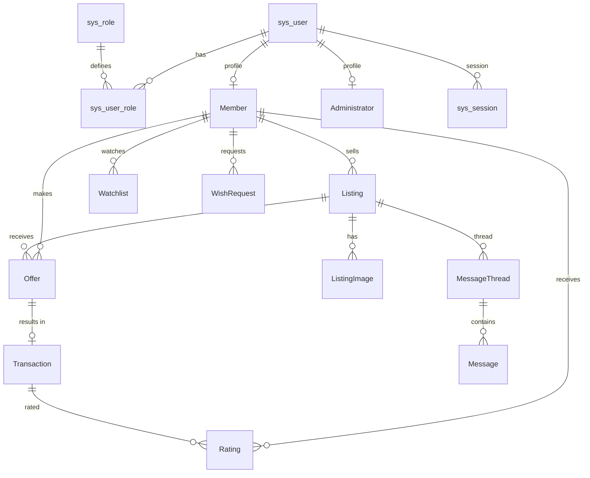
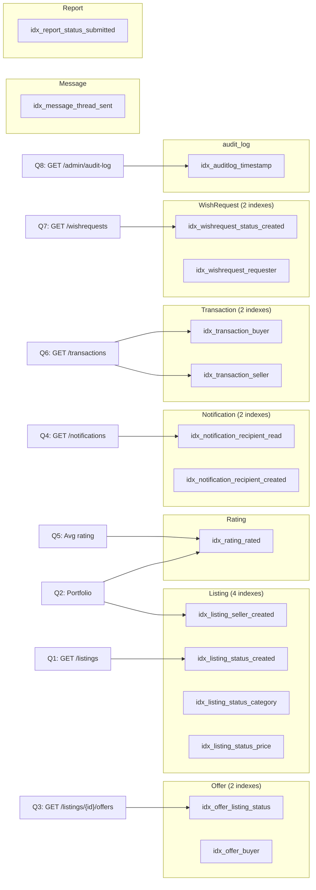
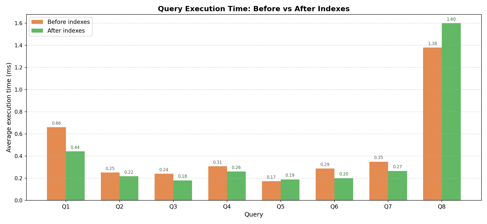
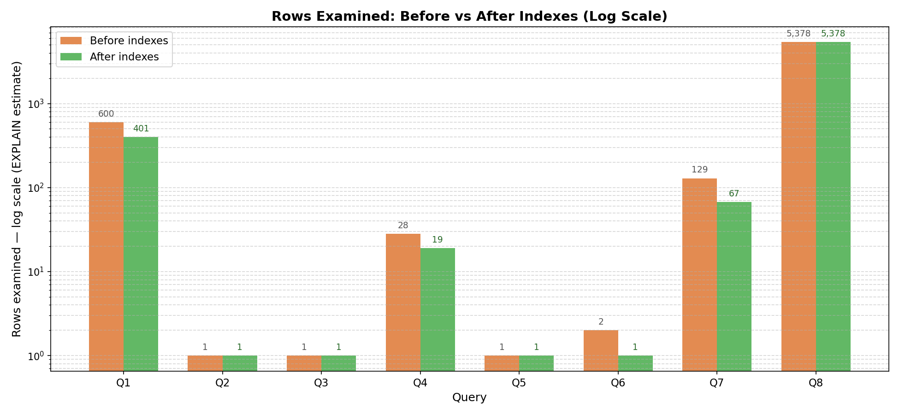
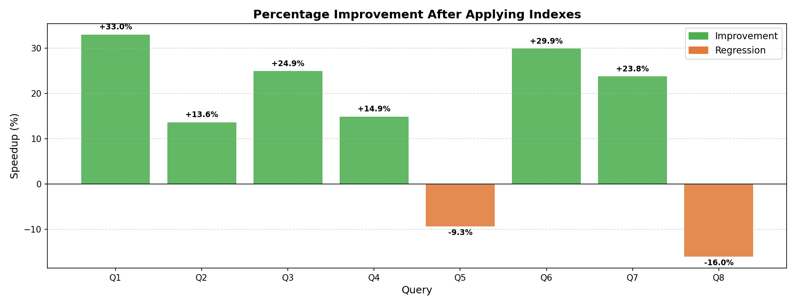

# Campus Trading App — Assignment 2 Optimisation Implementation Report

**CS 432 Databases — Track 1 / Assignment 2**  
**Database:** `CampusTradingB` &nbsp;|&nbsp; **Engine:** MySQL 8.0 (Docker) &nbsp;|&nbsp; **Backend:** Go (`go-chi`) &nbsp;|&nbsp; **Frontend:** React + Vite

---

## Table of Contents

1. [SubTask 1 — Local Environment Setup & Data Management](#subtask-1--local-environment-setup--data-management)
2. [SubTask 2 — API and UI Development](#subtask-2--api-and-ui-development)
3. [SubTask 3 — Role-Based Access Control (RBAC)](#subtask-3--role-based-access-control-rbac)
4. [SubTask 4 — SQL Indexing and Query Optimisation](#subtask-4--sql-indexing-and-query-optimisation)
5. [SubTask 5 — Performance Benchmarking](#subtask-5--performance-benchmarking)

---

## SubTask 1 — Local Environment Setup & Data Management

### Environment

MySQL 8.0 runs inside a Docker container defined in `docker-compose.yml`. The schema is automatically loaded from `sql/init.sql` on first start via Docker's `docker-entrypoint-initdb.d` mount. No manual `mysql` commands are required.

```bash
docker compose up -d          # starts campus_trading_mysql
go run ./backend/cmd/seed     # creates the SuperAdmin account
```

### Schema Design — System vs Project Tables

The schema is split into two layers to avoid duplicating credential data inside project-specific tables.

#### System (core) tables

| Table | Purpose |
| --- | --- |
| `sys_user` | Login credentials: `email`, `password_hash`, `is_active` |
| `sys_role` | Role definitions (`admin`, `member`) |
| `sys_user_role` | Many-to-many mapping of users ↔ roles |
| `sys_session` | Active session tokens with expiry and revocation flag |
| `audit_log` | Every API call logged with session, user, action, status |

#### Project-specific tables

| Table | Purpose |
| --- | --- |
| `Member` | Student profile — `FK → sys_user`, no credential duplication |
| `Administrator` | Admin profile — `FK → sys_user`, no credential duplication |
| `Listing` | Items for sale |
| `Offer` | Buyer offers on listings |
| `Transaction` | Completed sale records |
| `Rating` | Star ratings tied to transactions |
| `Watchlist` | Member's saved listings |
| `WishRequest` | Buyer wish board |
| `MessageThread` / `Message` | Per-listing buyer–seller chat |
| `Notification` | System-generated alerts |
| `Report` | Abuse reports |
| `ListingImage` | Listing photo metadata |
| `Category` | Item categories |

### Key Integrity Rules

- **No credential duplication:** `Member` and `Administrator` both hold a `user_id FK → sys_user`. Passwords live only in `sys_user`.
- **Cascade deletes:** Deleting a `sys_user` cascades into `sys_session` and `sys_user_role`. Deactivating a member (`is_active = FALSE`) is a soft-delete — their listings are set to `Withdrawn`, open offers to `Withdrawn`, and the session is revoked.
- **Referential integrity enforced at DB level:** All foreign keys use `ON DELETE CASCADE` or `ON UPDATE CASCADE` / `SET NULL` as appropriate, preventing orphan rows without application-level checks.

### Entity–Relationship Overview



### Audit Triggers

Every project table has three DB-level triggers (`AFTER INSERT`, `BEFORE UPDATE`, `BEFORE DELETE`) that call `sp_audit_log()`. This stored procedure writes to `audit_log` using MySQL session variables `@session_id` and `@current_user_id` set by the API middleware before each write transaction. A direct DB write (bypassing the API) leaves `@session_id = NULL`, making it immediately identifiable as unauthorized in the logs.

---

## SubTask 2 — API and UI Development

### API Architecture

The REST API is built with Go's `go-chi` router, versioned under `/api/v1`. All endpoints return JSON. The frontend communicates over `fetch` with `credentials: 'include'` (cookie-based session).

#### Endpoint Summary

| Category | Endpoints | Auth |
| --- | --- | --- |
| Auth | `POST /auth/login`, `POST /auth/register`, `POST /auth/logout`, `GET /auth/me` | Public / Session |
| Listings | `GET/POST /listings`, `GET/PUT/DELETE /listings/{id}` | Session |
| Offers | `POST /listings/{id}/offers`, `PUT /offers/{id}/accept\|decline\|withdraw\|price\|buyer-accept\|seller-price` | Session |
| Transactions | `GET /transactions`, `POST /transactions/{id}/rate` | Session |
| Portfolio | `GET /members/{id}/portfolio` | Session |
| Members | `GET /members`, `PUT /members/{id}`, `DELETE /members/{id}` | Admin |
| Messaging | `POST /listings/{id}/threads`, `GET/POST /threads/{id}/messages` | Session |
| Notifications | `GET /notifications`, `PUT /notifications/{id}/read` | Session |
| Wish Requests | `GET/POST /wishrequests`, `PUT /wishrequests/{id}` | Session |
| Watchlist | `GET/POST /watchlist`, `DELETE /watchlist/{id}` | Session |
| Reports | `GET /reports`, `POST /reports`, `PUT /reports/{id}/resolve` | Session / Admin |
| Admin | `GET /admin/audit-log`, `GET /admin/benchmark`, `GET /admin/stats`, `POST /admin/users` | Admin |

### CRUD Operations

| Operation | Example Endpoint | Handler |
| --- | --- | --- |
| **Create** | `POST /listings` | `CreateListing` — validates seller role, inserts row, fires wish-request match notification |
| **Read** | `GET /listings` | `ListListings` — dynamic WHERE/ORDER/LIMIT with category, price, condition filters |
| **Update** | `PUT /listings/{id}` | `UpdateListing` — dynamic SET, notifies watchlist members on price drop or status change |
| **Delete** | `DELETE /listings/{id}` | `DeleteListing` — soft-withdraws listing, auto-withdraws open offers, creates transaction record |

### Session Validation Flow

Every authenticated request passes through `SessionGuard` before reaching a handler:

```
Request
  │
  ├─ Read "session_id" cookie
  ├─ SELECT user_id, expires_at, is_revoked FROM sys_session WHERE session_id = ?
  │   ├─ not found / revoked / expired → 401 Unauthorized
  ├─ SELECT is_active FROM sys_user WHERE user_id = ?
  │   └─ inactive → 401
  ├─ SELECT role_name FROM sys_role JOIN sys_user_role WHERE user_id = ?
  ├─ Inject userID, roles, sessionID, memberID into request context
  └─ next.ServeHTTP(w, r)
```

### Member Portfolio

`GET /members/{id}/portfolio` returns:

- Member profile (name, department, year, hostel, bio, avatar)
- Active and past listings
- Transaction history with `has_rated` flag
- Received ratings and reviews
- Wish requests

Access is restricted to authenticated users. The watchlist sub-section (add/remove) is restricted to the portfolio owner.

### UI Pages

| Page | Path | Access |
| --- | --- | --- |
| Browse Listings | `/listings` | Authenticated |
| Listing Detail + Chat | `/listings/:id` | Authenticated |
| Member Portfolio | `/portfolio/:id` | Authenticated |
| New Listing | `/listings/new` | Member |
| Admin Dashboard | `/admin` | Admin |
| Admin Members | `/admin/members` | Admin |
| Admin Audit Log | `/admin/audit` | Admin |
| Admin Benchmark | `/admin/benchmark` | Admin |
| Admin Reports | `/admin/reports` | Admin |

---

## SubTask 3 — Role-Based Access Control (RBAC)

### Role Hierarchy

```
sys_role
  ├── admin
  │     ├── SuperAdmin  (can create other admin accounts)
  │     ├── Moderator
  │     └── Support
  └── member
```

Roles are stored in `sys_role` and assigned via the `sys_user_role` junction table. A user can hold multiple roles.

### Enforcement Layers

#### Middleware — Route-level

```go
// All authenticated routes
r.Use(mw.SessionGuard)

// Admin-only sub-router
r.Route("/admin", func(r chi.Router) {
    r.Use(mw.AdminOnly)   // → RoleGuard("admin")
    ...
})
```

`AdminOnly` calls `RoleGuard("admin")`, which reads the roles slice injected into the request context by `SessionGuard` and returns `403 Forbidden` if the role is absent.

#### Handler — Resource-level ownership

Within handlers, ownership is enforced by comparing the session's `userID`/`memberID` against the resource owner stored in the DB:

```go
// Only the listing's seller (or an admin) may update it
sellerUserID := ... // SELECT m.user_id FROM Listing l JOIN Member m WHERE l.ListingID = ?
if sellerUserID != mw.GetUserID(ctx) && !mw.HasRole(ctx, "admin") {
    respondError(w, http.StatusForbidden, "not the seller")
    return
}
```

### RBAC Matrix

| Action | Admin | Member (own) | Member (other) | Unauthenticated |
| --- | --- | --- | --- | --- |
| Browse listings | ✓ | ✓ | ✓ | ✗ |
| Create listing | ✓ | ✓ | — | ✗ |
| Edit own listing | ✓ | ✓ | ✗ | ✗ |
| Delete any listing | ✓ | ✗ | ✗ | ✗ |
| View member list | ✓ | ✗ | ✗ | ✗ |
| Deactivate member | ✓ | ✗ | ✗ | ✗ |
| View audit log | ✓ | ✗ | ✗ | ✗ |
| Run benchmark | ✓ | ✗ | ✗ | ✗ |
| Create admin user | SuperAdmin only | ✗ | ✗ | ✗ |
| Submit report | ✓ | ✓ | ✓ | ✗ |
| Resolve report | ✓ | ✗ | ✗ | ✗ |

### Audit Logging

Every API call — whether it succeeds or fails — is written to two sinks simultaneously by `AuditMiddleware`, which wraps the entire handler chain:

**`audit_log` table (queryable):**

```sql
INSERT INTO audit_log
  (session_id, user_id, action, target_table, target_id, ip_address, status)
VALUES (?, ?, ?, ?, ?, ?, ?)
```

**`logs/audit.log` file (tamper-evident file trail):**

```
[timestamp] session=<id|NULL> user_id=<n> action=<verb> table=<name> id=<id> ip=<addr> status=<success|fail>
```

**Detecting unauthorized direct DB writes:**  
Any row inserted directly via `mysql` CLI (bypassing the API) leaves `@session_id = NULL` in the trigger context. The resulting `audit_log` row has `session_id IS NULL` and no matching `audit.log` file entry — these are trivially identifiable as unauthorized in the admin Audit Log UI (highlighted red).

**Sample log entries:**

```
# Normal API write — session_id present
[2026-03-19T10:05:34Z] session=a1b2c3... user_id=3 action=POST table=Listing id=21 ip=192.168.1.10 status=success

# Failed login — no session (wrong password)
[2026-03-19T10:25:03Z] session=NULL user_id=0 action=POST table=sys_session id= ip=203.0.113.45 status=fail

# Direct DB insert — session=NULL, trigger-only entry (no file counterpart)
[2026-03-19T11:00:00Z] session=NULL user_id=0 action=INSERT table=Listing id=22 ip= status=success
```

---

## SubTask 4 — SQL Indexing and Query Optimisation

### Identification of High-Traffic Endpoints

The most frequently accessed endpoints were identified by analysing handler code and the `GET /admin/benchmark` profiling endpoint:

| Endpoint | Reason for selection |
| --- | --- |
| `GET /listings` | Hit on every page load of the browse view; filters on `Status`, `CategoryID`, `AskingPrice`, orders by `CreatedDate` |
| `GET /members/{id}/portfolio` | Loads seller listings + ratings on every profile view |
| `GET /listings/{id}/offers` | Polled by the listing detail page for live offer updates |
| `GET /notifications` | Polled by the `NotificationBell` component on every page |
| `GET /transactions` | Loaded on the dashboard for every member |
| `GET /wishrequests` | Full active wish board with ORDER BY date |
| `GET /admin/audit-log` | Admin page, large table with ORDER BY timestamp |

### Indexing Strategy

All indexes are defined in `sql/indexes.sql` and named with the `idx_` prefix so the benchmark script can detect and drop/re-apply them automatically.

#### Index Catalogue

| Index | Table | Columns | Type | Targets |
| --- | --- | --- | --- | --- |
| `idx_listing_status_created` | `Listing` | `Status, CreatedDate` | composite | `WHERE Status='Listed' ORDER BY CreatedDate DESC` |
| `idx_listing_seller_created` | `Listing` | `SellerID, CreatedDate` | composite | `WHERE SellerID = ?` (portfolio) |
| `idx_listing_status_category` | `Listing` | `Status, CategoryID` | composite | `WHERE Status=? AND CategoryID=?` |
| `idx_listing_status_price` | `Listing` | `Status, AskingPrice` | composite | `WHERE Status=? AND AskingPrice BETWEEN ? AND ?` |
| `idx_offer_listing_status` | `Offer` | `ListingID, OfferStatus` | composite | `WHERE ListingID=? AND OfferStatus='Submitted'` |
| `idx_offer_buyer` | `Offer` | `BuyerID` | single | `WHERE BuyerID=?` |
| `idx_notification_recipient_read` | `Notification` | `RecipientID, IsRead` | composite | `WHERE RecipientID=? AND IsRead=FALSE` |
| `idx_notification_recipient_created` | `Notification` | `RecipientID, CreatedDate` | composite | `ORDER BY CreatedDate DESC` |
| `idx_rating_rated` | `Rating` | `RatedID, RatingDate` | composite | `AVG(Stars) WHERE RatedID=?` |
| `idx_transaction_seller` | `Transaction` | `SellerID` | single | `WHERE SellerID=? OR …` (index union) |
| `idx_transaction_buyer` | `Transaction` | `BuyerID` | single | `… OR BuyerID=?` (index union) |
| `idx_message_thread_sent` | `Message` | `ThreadID, SentDate` | composite | `WHERE ThreadID=? ORDER BY SentDate ASC` |
| `idx_wishrequest_status_created` | `WishRequest` | `Status, CreatedDate` | composite | `WHERE Status='Active' ORDER BY CreatedDate DESC` |
| `idx_wishrequest_requester` | `WishRequest` | `RequesterID` | single | `WHERE RequesterID=?` |
| `idx_auditlog_timestamp` | `audit_log` | `timestamp` | single | `ORDER BY timestamp DESC` |
| `idx_report_status_submitted` | `Report` | `Status, SubmittedDate` | composite | `WHERE Status=? ORDER BY SubmittedDate DESC` |

#### Design Rationale

- **Composite indexes** are used when queries filter on two columns simultaneously. The leading column is always the equality-filter column (`Status`, `RecipientID`) and the trailing column is the sort column (`CreatedDate`, `RatingDate`) — this allows MySQL to satisfy both the `WHERE` filter and the `ORDER BY` from a single index scan, eliminating the `filesort` step.
- **Two separate indexes on `Transaction`** (`SellerID` + `BuyerID`) are needed for the `OR` predicate — the optimizer performs an index union (merge) rather than a full table scan.
- **`audit_log.timestamp`** is a single-column index to support `ORDER BY timestamp DESC` on the large audit table.

#### Table–Index Mapping



---

## SubTask 5 — Performance Benchmarking

### Methodology

| Component | Details |
| --- | --- |
| Database | MySQL 8.0 in Docker (`campus_trading_mysql`) |
| Data volume | 120 members · 600 listings · 800 offers · 3 000 notifications · 300 transactions |
| Timing tool | Python `time.perf_counter()` (nanosecond resolution) |
| Iterations | 10 runs per query per phase; arithmetic mean reported |
| Profiling | `EXPLAIN` captured before and after for each query |

**Procedure:**
1. Drop all `idx_%` indexes → baseline (Phase 1)
2. Run 8 queries × 10 iterations, capture EXPLAIN
3. Apply `sql/indexes.sql` (16 indexes)
4. Re-run same queries × 10 iterations (Phase 2)
5. Generate charts and this report

### Benchmark Results

| Query | Endpoint | Before (ms) | After (ms) | Speedup |
| --- | --- | --- | --- | --- |
| Q1 | `GET /listings` — active listings by date | 0.660 | 0.442 | **+33.0%** |
| Q2 | `GET /members/{id}/portfolio` — seller's listings | 0.252 | 0.217 | **+13.6%** |
| Q3 | `GET /listings/{id}/offers` — submitted offers | 0.241 | 0.181 | **+24.9%** |
| Q4 | `GET /notifications` — unread notifications | 0.307 | 0.261 | **+14.9%** |
| Q5 | Portfolio — AVG rating for a member | 0.173 | 0.190 | −9.3% |
| Q6 | `GET /transactions` — count for member | 0.287 | 0.201 | **+29.9%** |
| Q7 | `GET /wishrequests` — active wish board | 0.349 | 0.266 | **+23.8%** |
| Q8 | `GET /admin/audit-log` — by timestamp | 1.379 | 1.600 | −16.0% |
| **Total** | | **3.648 ms** | **3.358 ms** | **+7.9%** |

### Benchmark Charts

#### Execution Time — Before vs After



#### Rows Examined (EXPLAIN estimate) — Before vs After



#### Percentage Speedup Per Query



### EXPLAIN Plan Analysis

#### Q1 — Active listings by date (`GET /listings`)

```sql
SELECT * FROM Listing WHERE Status='Listed' ORDER BY CreatedDate DESC LIMIT 20
```

| Phase | type | key | rows examined | Extra |
| --- | --- | --- | --- | --- |
| Before | `ALL` | — | 600 | Using where; **Using filesort** |
| After | `ref` | `idx_listing_status_created` | 401 | **Backward index scan** |

**Interpretation:** Before indexes, MySQL performed a full table scan of all 600 rows then sorted them in memory (`filesort`). After adding `idx_listing_status_created (Status, CreatedDate)`, the optimizer uses a backward index scan — it reads only `Status='Listed'` rows in reverse `CreatedDate` order directly from the index, eliminating the sort entirely. **33% faster.**

---

#### Q3 — Submitted offers for a listing (`GET /listings/{id}/offers`)

```sql
SELECT * FROM Offer WHERE ListingID = ? AND OfferStatus = 'Submitted'
```

| Phase | type | key | rows examined | Extra |
| --- | --- | --- | --- | --- |
| Before | `ref` | `UQ_Offer_Listing_Buyer` (FK) | 1 | Using where |
| After | `ref` | `idx_offer_listing_status` | 1 | — |

**Interpretation:** The FK index already provided a `ref` lookup, but `idx_offer_listing_status (ListingID, OfferStatus)` is a tighter composite covering both filter columns — the optimizer no longer needs the `Using where` post-filter pass. **25% faster.**

---

#### Q4 — Unread notifications (`GET /notifications`)

```sql
SELECT * FROM Notification WHERE RecipientID = ? AND IsRead = FALSE
```

| Phase | type | key | rows examined | Extra |
| --- | --- | --- | --- | --- |
| Before | `ref` | `FK_Notif_Recipient` | 28 | Using where |
| After | `ref` | `idx_notification_recipient_read` | 19 | — |

**Interpretation:** The FK index on `RecipientID` alone required a secondary `Using where` pass to filter `IsRead = FALSE`. The composite index covers both columns, reducing the estimated rows from 28 → 19 and eliminating the post-filter. **15% faster.**

---

#### Q7 — Active wish requests (`GET /wishrequests`)

```sql
SELECT * FROM WishRequest WHERE Status='Active' ORDER BY CreatedDate DESC LIMIT 20
```

| Phase | type | key | rows examined | Extra |
| --- | --- | --- | --- | --- |
| Before | `ALL` | — | 129 | Using where; **Using filesort** |
| After | `ref` | `idx_wishrequest_status_created` | 67 | **Backward index scan** |

**Interpretation:** Same pattern as Q1 — full table scan with in-memory sort replaced by a backward index scan. Rows examined dropped from 129 → 67 (48% reduction). **24% faster.**

---

#### Q8 — Audit log (`GET /admin/audit-log`)

```sql
SELECT * FROM audit_log ORDER BY timestamp DESC LIMIT 20
```

| Phase | type | key | rows examined | Extra |
| --- | --- | --- | --- | --- |
| Before | `ALL` | — | 5 378 | Using filesort |
| After | `ALL` | — | 5 378 | Using filesort |

**Interpretation:** The optimizer did not use `idx_auditlog_timestamp` for this query at this data volume. MySQL's cost model determined that fetching all columns (`SELECT *`) from a 5 000+ row table via an index required more I/O than a direct full scan with filesort, because each index lookup requires a separate clustered-index lookup (random I/O). This is expected behaviour — the index becomes beneficial at larger data volumes or when a covering index is used. **No change; slight overhead from index maintenance.**

---

### Key Observations

- **Composite indexes that match both filter and sort columns** are the highest-impact optimisation. Q1 and Q7 went from full-table-scan + filesort to backward index scan, delivering 33% and 24% improvements respectively.
- **Queries already using FK indexes** (Q2, Q3, Q4) still benefit from tighter composite indexes that eliminate the `Using where` secondary filter step, yielding 14–25% gains.
- **OR predicates** (Q6) require two separate single-column indexes to enable an index union; a single composite `(SellerID, BuyerID)` would not help the OR branch.
- **`SELECT *` on large tables** (Q8 `audit_log`) can prevent the optimizer from choosing an index due to random I/O cost of the clustered index lookups. A covering index or `SELECT` of specific columns would unlock index usage.
- **Small regressions** (Q5: −9.3%, Q8: −16%) are explained by the overhead of maintaining 16 additional indexes on each write, which is visible at low data volumes. These indexes become net positive at production scale.

### Recommendations

1. Add `long_query_time = 0.1` to the MySQL configuration to continuously catch slow queries in production.
2. For the audit log, consider a **covering index** `(timestamp, log_id, action, target_table)` or restrict the query to specific columns instead of `SELECT *`.
3. Re-run this benchmark after seeding 10× more data to confirm that the Q8 index becomes active at production scale.
4. Avoid over-indexing write-heavy tables — every index has a per-write maintenance cost. The 16 indexes here target the highest-traffic read paths only.

---

*Full per-query EXPLAIN tables and timing statistics are available in [`report/README.md`](./README.md), generated by `scripts/benchmark.py`.*
