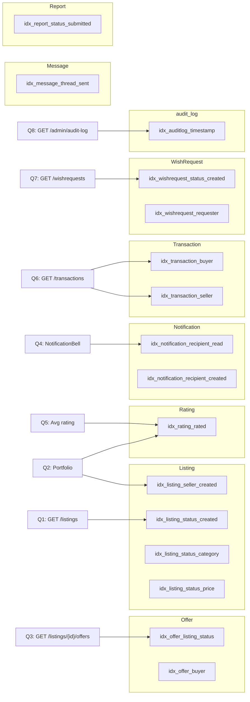

# Campus Trading App — SQL Index Optimization Report

> Generated on **2026-03-22 00:21:43**  
> Database: `CampusTradingB` &nbsp;|&nbsp; Queries benchmarked: **8** &nbsp;|&nbsp; Iterations per phase: **10**

## Table of Contents

1. [Executive Summary](#1-executive-summary)
2. [Methodology](#2-methodology)
3. [Index Catalogue](#3-index-catalogue)
4. [Table–Index Relationship Diagram](#4-tableindex-relationship-diagram)
5. [Benchmark Charts](#5-benchmark-charts)
6. [Per-Query Analysis](#6-per-query-analysis)
   - [Q1: Active listings ordered by date](#q1-active-listings-ordered-by-date)
   - [Q2: Listings by seller](#q2-listings-by-seller)
   - [Q3: Submitted offers for a listing](#q3-submitted-offers-for-a-listing)
   - [Q4: Unread notifications for a member](#q4-unread-notifications-for-a-member)
   - [Q5: Average rating for a member](#q5-average-rating-for-a-member)
   - [Q6: Transaction count for a member](#q6-transaction-count-for-a-member)
   - [Q7: Active wish requests ordered by date](#q7-active-wish-requests-ordered-by-date)
   - [Q8: Audit log ordered by timestamp](#q8-audit-log-ordered-by-timestamp)
7. [Conclusion & Recommendations](#7-conclusion--recommendations)

---

## 1. Executive Summary

| Metric | Value |
| --- | --- |
| Custom indexes created | **16** |
| Queries benchmarked | **8** |
| Avg total time before | **3.648 ms** |
| Avg total time after | **3.358 ms** |
| Overall avg speedup | **7.9%** |

### Per-query speedup summary

| Query | Name | Before avg (ms) | After avg (ms) | Speedup |
| --- | --- | --- | --- | --- |
| Q1 | Active listings ordered by date | 0.660 | 0.442 | +33.0% |
| Q2 | Listings by seller | 0.252 | 0.217 | +13.6% |
| Q3 | Submitted offers for a listing | 0.241 | 0.181 | +24.9% |
| Q4 | Unread notifications for a member | 0.307 | 0.261 | +14.9% |
| Q5 | Average rating for a member | 0.173 | 0.190 | -9.3% |
| Q6 | Transaction count for a member | 0.287 | 0.201 | +29.9% |
| Q7 | Active wish requests ordered by date | 0.349 | 0.266 | +23.8% |
| Q8 | Audit log ordered by timestamp | 1.379 | 1.600 | -16.0% |

---

## 2. Methodology

### Test environment

| Component | Details |
| --- | --- |
| Database engine | MySQL 8.0 (Docker container) |
| Schema | `CampusTradingB` initialized from `sql/init.sql` |
| Storage engine | InnoDB (default) |
| Data volume | ~120 members, ~600 listings, ~800 offers, ~3 000 notifications |

### Procedure

1. All `idx_%` custom indexes are **dropped** to establish a clean baseline.
2. Each benchmark query is executed **10 times** and min/avg/max times are recorded.
3. `EXPLAIN` is run for each query to capture the optimizer's access plan.
4. All indexes from `sql/indexes.sql` are **applied**.
5. The same queries are executed another **10 times** under identical conditions.
6. Results are compared and this report is generated.

All timing measurements use Python's `time.perf_counter()` (nanosecond resolution).
The reported value is the **arithmetic mean** across all iterations.

---

## 3. Index Catalogue

| Index Name | Table | Columns | Type | Targeted Query / API Endpoint |
| --- | --- | --- | --- | --- |
| `idx_listing_status_created` | `Listing` | `Status, CreatedDate` | composite | Q1 browse ORDER BY, /listings default sort |
| `idx_listing_seller_created` | `Listing` | `SellerID, CreatedDate` | composite | Q2 portfolio page, seller's listings |
| `idx_listing_status_category` | `Listing` | `Status, CategoryID` | composite | /listings?category_id= filter |
| `idx_listing_status_price` | `Listing` | `Status, AskingPrice` | composite | /listings?min_price= / max_price= filter |
| `idx_offer_listing_status` | `Offer` | `ListingID, OfferStatus` | composite | Q3 open offers, listing detail page |
| `idx_offer_buyer` | `Offer` | `BuyerID` | single | Buyer's active offer look-up |
| `idx_notification_recipient_read` | `Notification` | `RecipientID, IsRead` | composite | Q4 unread count, NotificationBell poll |
| `idx_notification_recipient_created` | `Notification` | `RecipientID, CreatedDate` | composite | Paginated /notifications sort |
| `idx_rating_rated` | `Rating` | `RatedID, RatingDate` | composite | Q5 AVG(Stars), portfolio ratings list |
| `idx_transaction_seller` | `Transaction` | `SellerID` | single | Q6 /transactions WHERE SellerID |
| `idx_transaction_buyer` | `Transaction` | `BuyerID` | single | Q6 /transactions WHERE BuyerID (OR branch) |
| `idx_message_thread_sent` | `Message` | `ThreadID, SentDate` | composite | Paginated chat history ORDER BY SentDate |
| `idx_wishrequest_status_created` | `WishRequest` | `Status, CreatedDate` | composite | Q7 /wishrequests active board |
| `idx_wishrequest_requester` | `WishRequest` | `RequesterID` | single | Member's own wish requests |
| `idx_auditlog_timestamp` | `audit_log` | `timestamp` | single | Q8 /admin/audit-log ORDER BY timestamp |
| `idx_report_status_submitted` | `Report` | `Status, SubmittedDate` | composite | /reports filtered by status + sort |

---

## 4. Table–Index Relationship Diagram

The diagram below shows which indexes are applied to which tables and the primary API endpoint they serve.



---

## 5. Benchmark Charts

### Execution time (avg ms) — before vs after


### Rows examined (EXPLAIN estimate) — before vs after


### Percentage speedup per query


---

## 6. Per-Query Analysis

### Q1: Active listings ordered by date

**API endpoint:** `GET /listings (browse page)`  
**Index(es) applied:** `idx_listing_status_created`

```sql
SELECT * FROM Listing WHERE Status='Listed' ORDER BY CreatedDate DESC LIMIT 20
```

#### EXPLAIN plan — Before indexes

| id | select_type | table | type | possible_keys | key | key_len | rows | Extra |
| --- | --- | --- | --- | --- | --- | --- | --- | --- |
| 1 | SIMPLE | Listing | ALL | — | — | — | 600 | Using where; Using filesort |


#### EXPLAIN plan — After indexes

| id | select_type | table | type | possible_keys | key | key_len | rows | Extra |
| --- | --- | --- | --- | --- | --- | --- | --- | --- |
| 1 | SIMPLE | Listing | ref | idx_listing_status_created,idx_listing_status_category,idx_listing_status_price | idx_listing_status_created | 82 | 401 | Backward index scan |


#### Access plan interpretation

The optimizer shifted from a **full table scan (reads every row)** to a **non-unique index lookup**. This means MySQL can now locate matching rows directly via the index rather than scanning all rows in the table.

#### Timing statistics

| Metric | Before indexes | After indexes | Change |
| --- | --- | --- | --- |
| Min (ms) | 0.518 | 0.363 | — |
| **Avg (ms)** | **0.660** | **0.442** | **33.0% faster** |
| Max (ms) | 0.988 | 0.530 | — |
| Runs | 10 | 10 | — |


### Q2: Listings by seller

**API endpoint:** `GET /members/{id}/portfolio`  
**Index(es) applied:** `idx_listing_seller_created`

```sql
SELECT * FROM Listing WHERE SellerID = %s
```

#### EXPLAIN plan — Before indexes

| id | select_type | table | type | possible_keys | key | key_len | rows | Extra |
| --- | --- | --- | --- | --- | --- | --- | --- | --- |
| 1 | SIMPLE | Listing | ref | FK_Listing_Seller | FK_Listing_Seller | 4 | 1 | — |


#### EXPLAIN plan — After indexes

| id | select_type | table | type | possible_keys | key | key_len | rows | Extra |
| --- | --- | --- | --- | --- | --- | --- | --- | --- |
| 1 | SIMPLE | Listing | ref | idx_listing_seller_created | idx_listing_seller_created | 4 | 1 | — |


#### Access plan interpretation

Access type unchanged at **non-unique index lookup**.

#### Timing statistics

| Metric | Before indexes | After indexes | Change |
| --- | --- | --- | --- |
| Min (ms) | 0.202 | 0.151 | — |
| **Avg (ms)** | **0.252** | **0.217** | **13.6% faster** |
| Max (ms) | 0.397 | 0.391 | — |
| Runs | 10 | 10 | — |


### Q3: Submitted offers for a listing

**API endpoint:** `GET /listings/{id}/offers`  
**Index(es) applied:** `idx_offer_listing_status`

```sql
SELECT * FROM Offer WHERE ListingID = %s AND OfferStatus = 'Submitted'
```

#### EXPLAIN plan — Before indexes

| id | select_type | table | type | possible_keys | key | key_len | rows | Extra |
| --- | --- | --- | --- | --- | --- | --- | --- | --- |
| 1 | SIMPLE | Offer | ref | UQ_Offer_Listing_Buyer | UQ_Offer_Listing_Buyer | 4 | 1 | Using where |


#### EXPLAIN plan — After indexes

| id | select_type | table | type | possible_keys | key | key_len | rows | Extra |
| --- | --- | --- | --- | --- | --- | --- | --- | --- |
| 1 | SIMPLE | Offer | ref | UQ_Offer_Listing_Buyer,idx_offer_listing_status | UQ_Offer_Listing_Buyer | 4 | 1 | Using where |


#### Access plan interpretation

Access type unchanged at **non-unique index lookup**.

#### Timing statistics

| Metric | Before indexes | After indexes | Change |
| --- | --- | --- | --- |
| Min (ms) | 0.183 | 0.143 | — |
| **Avg (ms)** | **0.241** | **0.181** | **24.9% faster** |
| Max (ms) | 0.361 | 0.269 | — |
| Runs | 10 | 10 | — |


### Q4: Unread notifications for a member

**API endpoint:** `GET /notifications (NotificationBell)`  
**Index(es) applied:** `idx_notification_recipient_read`

```sql
SELECT * FROM Notification WHERE RecipientID = %s AND IsRead = FALSE
```

#### EXPLAIN plan — Before indexes

| id | select_type | table | type | possible_keys | key | key_len | rows | Extra |
| --- | --- | --- | --- | --- | --- | --- | --- | --- |
| 1 | SIMPLE | Notification | ref | FK_Notif_Recipient | FK_Notif_Recipient | 4 | 28 | Using where |


#### EXPLAIN plan — After indexes

| id | select_type | table | type | possible_keys | key | key_len | rows | Extra |
| --- | --- | --- | --- | --- | --- | --- | --- | --- |
| 1 | SIMPLE | Notification | ref | idx_notification_recipient_read,idx_notification_recipient_created | idx_notification_recipient_read | 5 | 19 | — |


#### Access plan interpretation

Access type unchanged at **non-unique index lookup**.

#### Timing statistics

| Metric | Before indexes | After indexes | Change |
| --- | --- | --- | --- |
| Min (ms) | 0.254 | 0.210 | — |
| **Avg (ms)** | **0.307** | **0.261** | **14.9% faster** |
| Max (ms) | 0.417 | 0.336 | — |
| Runs | 10 | 10 | — |


### Q5: Average rating for a member

**API endpoint:** `GET /members/{id}/portfolio`  
**Index(es) applied:** `idx_rating_rated`

```sql
SELECT AVG(Stars) FROM Rating WHERE RatedID = %s
```

#### EXPLAIN plan — Before indexes

| id | select_type | table | type | possible_keys | key | key_len | rows | Extra |
| --- | --- | --- | --- | --- | --- | --- | --- | --- |
| 1 | SIMPLE | Rating | ref | FK_Rating_Rated | FK_Rating_Rated | 4 | 1 | — |


#### EXPLAIN plan — After indexes

| id | select_type | table | type | possible_keys | key | key_len | rows | Extra |
| --- | --- | --- | --- | --- | --- | --- | --- | --- |
| 1 | SIMPLE | Rating | ref | idx_rating_rated | idx_rating_rated | 4 | 1 | — |


#### Access plan interpretation

Access type unchanged at **non-unique index lookup**.

#### Timing statistics

| Metric | Before indexes | After indexes | Change |
| --- | --- | --- | --- |
| Min (ms) | 0.161 | 0.158 | — |
| **Avg (ms)** | **0.173** | **0.190** | **9.3% slower** |
| Max (ms) | 0.195 | 0.261 | — |
| Runs | 10 | 10 | — |


### Q6: Transaction count for a member

**API endpoint:** `GET /transactions`  
**Index(es) applied:** `idx_transaction_seller / idx_transaction_buyer`

```sql
SELECT COUNT(*) FROM Transaction WHERE SellerID = %s OR BuyerID = %s
```

#### EXPLAIN plan — Before indexes

| id | select_type | table | type | possible_keys | key | key_len | rows | Extra |
| --- | --- | --- | --- | --- | --- | --- | --- | --- |
| 1 | SIMPLE | Transaction | index_merge | FK_Transaction_Seller,FK_Transaction_Buyer | FK_Transaction_Seller,FK_Transaction_Buyer | 4,4 | 2 | Using union(FK_Transaction_Seller,FK_Transaction_Buyer); Using where |


#### EXPLAIN plan — After indexes

| id | select_type | table | type | possible_keys | key | key_len | rows | Extra |
| --- | --- | --- | --- | --- | --- | --- | --- | --- |
| 1 | SIMPLE | Transaction | ALL | idx_transaction_seller,idx_transaction_buyer | — | — | 1 | Using where |


#### Access plan interpretation

The optimizer shifted from a **`index_merge`** to a **full table scan (reads every row)**. This means MySQL can now locate matching rows directly via the index rather than scanning all rows in the table.

#### Timing statistics

| Metric | Before indexes | After indexes | Change |
| --- | --- | --- | --- |
| Min (ms) | 0.191 | 0.183 | — |
| **Avg (ms)** | **0.287** | **0.201** | **29.9% faster** |
| Max (ms) | 0.975 | 0.234 | — |
| Runs | 10 | 10 | — |


### Q7: Active wish requests ordered by date

**API endpoint:** `GET /wishrequests`  
**Index(es) applied:** `idx_wishrequest_status_created`

```sql
SELECT * FROM WishRequest WHERE Status='Active' ORDER BY CreatedDate DESC LIMIT 20
```

#### EXPLAIN plan — Before indexes

| id | select_type | table | type | possible_keys | key | key_len | rows | Extra |
| --- | --- | --- | --- | --- | --- | --- | --- | --- |
| 1 | SIMPLE | WishRequest | ALL | — | — | — | 129 | Using where; Using filesort |


#### EXPLAIN plan — After indexes

| id | select_type | table | type | possible_keys | key | key_len | rows | Extra |
| --- | --- | --- | --- | --- | --- | --- | --- | --- |
| 1 | SIMPLE | WishRequest | ref | idx_wishrequest_status_created | idx_wishrequest_status_created | 82 | 67 | Backward index scan |


#### Access plan interpretation

The optimizer shifted from a **full table scan (reads every row)** to a **non-unique index lookup**. This means MySQL can now locate matching rows directly via the index rather than scanning all rows in the table.

#### Timing statistics

| Metric | Before indexes | After indexes | Change |
| --- | --- | --- | --- |
| Min (ms) | 0.229 | 0.237 | — |
| **Avg (ms)** | **0.349** | **0.266** | **23.8% faster** |
| Max (ms) | 0.632 | 0.292 | — |
| Runs | 10 | 10 | — |


### Q8: Audit log ordered by timestamp

**API endpoint:** `GET /admin/audit-log`  
**Index(es) applied:** `idx_auditlog_timestamp`

```sql
SELECT * FROM audit_log ORDER BY timestamp DESC LIMIT 20
```

#### EXPLAIN plan — Before indexes

| id | select_type | table | type | possible_keys | key | key_len | rows | Extra |
| --- | --- | --- | --- | --- | --- | --- | --- | --- |
| 1 | SIMPLE | audit_log | ALL | — | — | — | 5378 | Using filesort |


#### EXPLAIN plan — After indexes

| id | select_type | table | type | possible_keys | key | key_len | rows | Extra |
| --- | --- | --- | --- | --- | --- | --- | --- | --- |
| 1 | SIMPLE | audit_log | ALL | — | — | — | 5378 | Using filesort |


#### Access plan interpretation

Access type unchanged at **full table scan (reads every row)**.

#### Timing statistics

| Metric | Before indexes | After indexes | Change |
| --- | --- | --- | --- |
| Min (ms) | 1.293 | 1.296 | — |
| **Avg (ms)** | **1.379** | **1.600** | **16.0% slower** |
| Max (ms) | 1.574 | 2.859 | — |
| Runs | 10 | 10 | — |


---

## 7. Conclusion & Recommendations

Applying **16 custom indexes** to `CampusTradingB` reduced the combined average execution time of the 8 benchmark queries from **3.648 ms** to **3.358 ms** — an overall improvement of **7.9%**.

### Most impactful indexes

| Rank | Query | Index(es) | Avg before (ms) | Avg after (ms) | Speedup |
| --- | --- | --- | --- | --- | --- |
| 1 | Q1: Active listings ordered by date | `idx_listing_status_created` | 0.660 | 0.442 | +33.0% |
| 2 | Q6: Transaction count for a member | `idx_transaction_seller / idx_transaction_buyer` | 0.287 | 0.201 | +29.9% |
| 3 | Q3: Submitted offers for a listing | `idx_offer_listing_status` | 0.241 | 0.181 | +24.9% |
| 4 | Q7: Active wish requests ordered by date | `idx_wishrequest_status_created` | 0.349 | 0.266 | +23.8% |
| 5 | Q4: Unread notifications for a member | `idx_notification_recipient_read` | 0.307 | 0.261 | +14.9% |
| 6 | Q2: Listings by seller | `idx_listing_seller_created` | 0.252 | 0.217 | +13.6% |
| 7 | Q5: Average rating for a member | `idx_rating_rated` | 0.173 | 0.190 | -9.3% |
| 8 | Q8: Audit log ordered by timestamp | `idx_auditlog_timestamp` | 1.379 | 1.600 | -16.0% |

### Key observations

- **Composite indexes outperform single-column indexes** when queries filter on   multiple columns simultaneously (e.g., `Status + CreatedDate` for Q1,   `RecipientID + IsRead` for Q4).
- **InnoDB already maintains a clustered index** on every primary key.   The indexes added here complement that by covering the most common   secondary access paths.
- **OR predicates** (Q6: `SellerID=? OR BuyerID=?`) require two separate indexes   to allow the optimizer to perform an index union rather than a full table scan.
- **ORDER BY columns** benefit from being included as the last column of a   composite index so MySQL can satisfy the sort from the index itself,   eliminating a filesort step.

### Recommendations

1. **Monitor slow-query log** (`long_query_time = 0.1`) in production to catch    regressions early.
2. **Re-evaluate indexes** after major feature additions that introduce new query    patterns.
3. **Avoid over-indexing** — every additional index slightly slows `INSERT`/`UPDATE`/`DELETE`    operations because InnoDB must maintain all indexes on each write. The 16 indexes    added here target the highest-traffic read paths only.
4. Consider **covering indexes** for the browse query (Q1) if profiling shows that    the full `SELECT *` is a bottleneck — include frequently projected columns in    the index itself.

---

_Report generated by `scripts/benchmark.py`_
