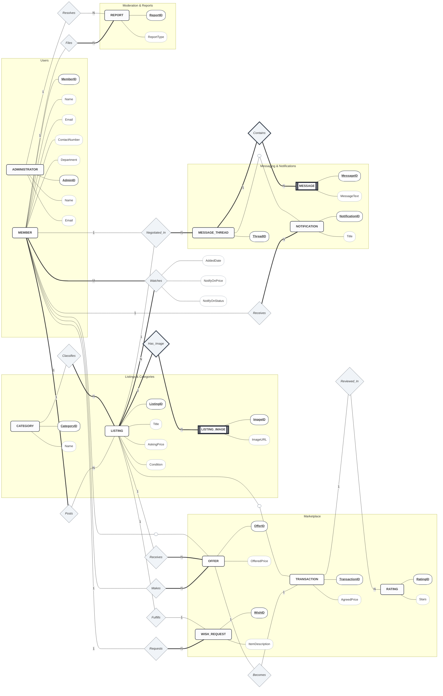
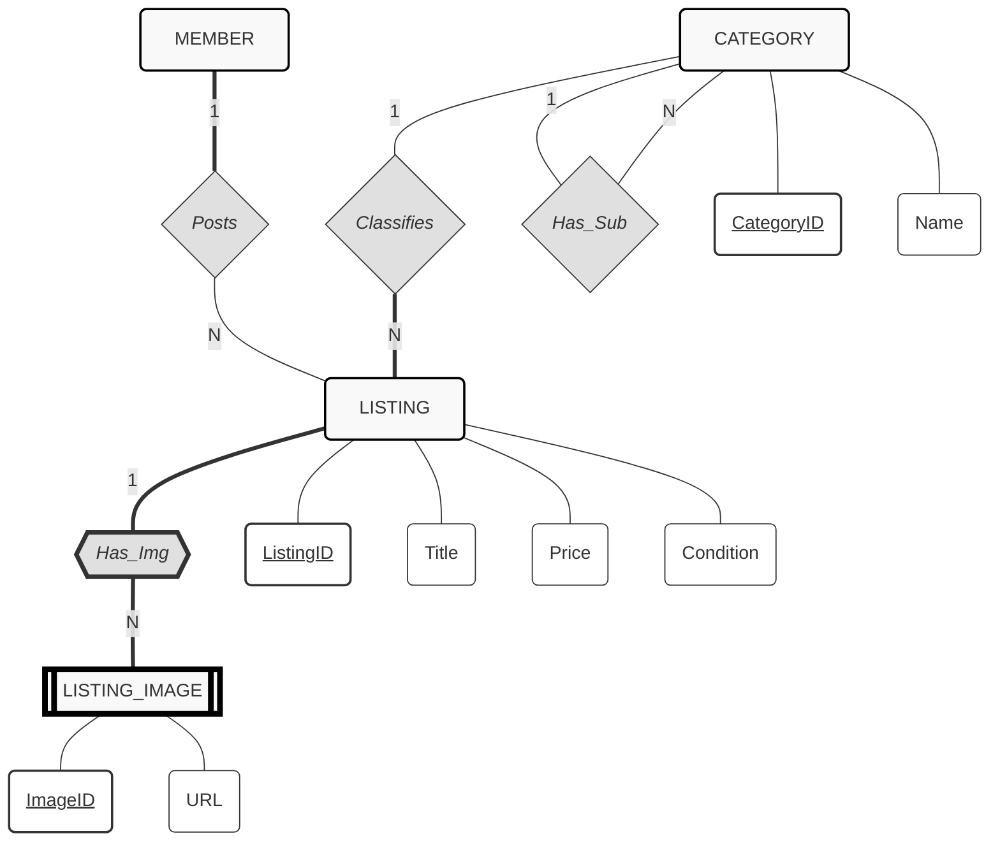
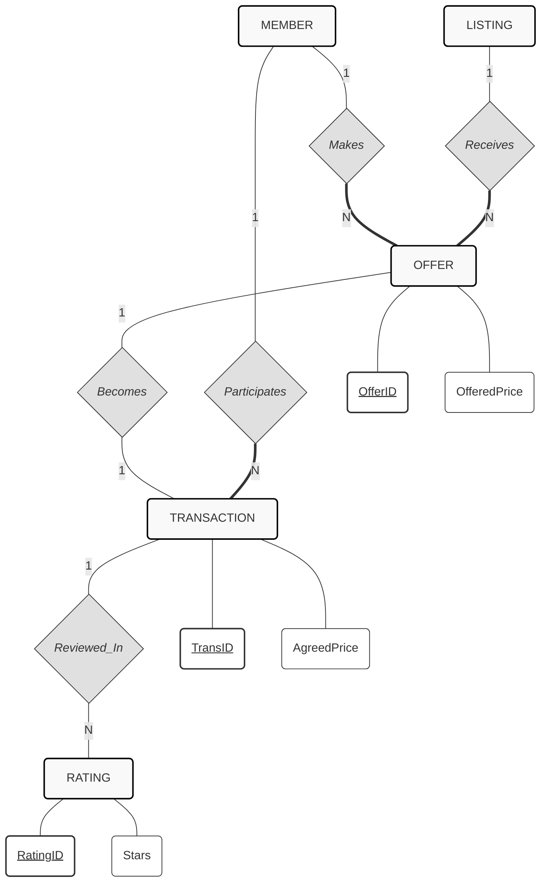
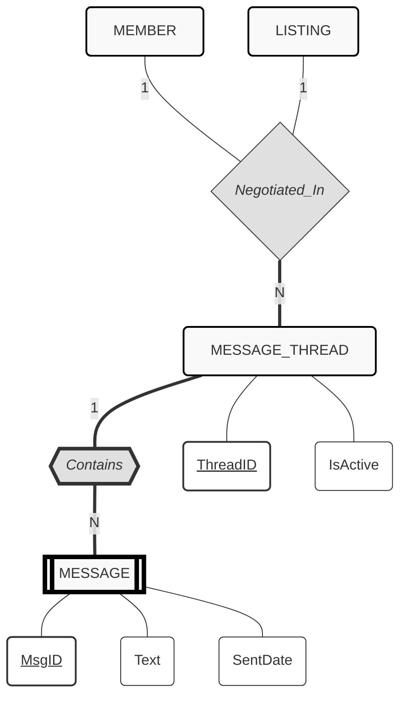
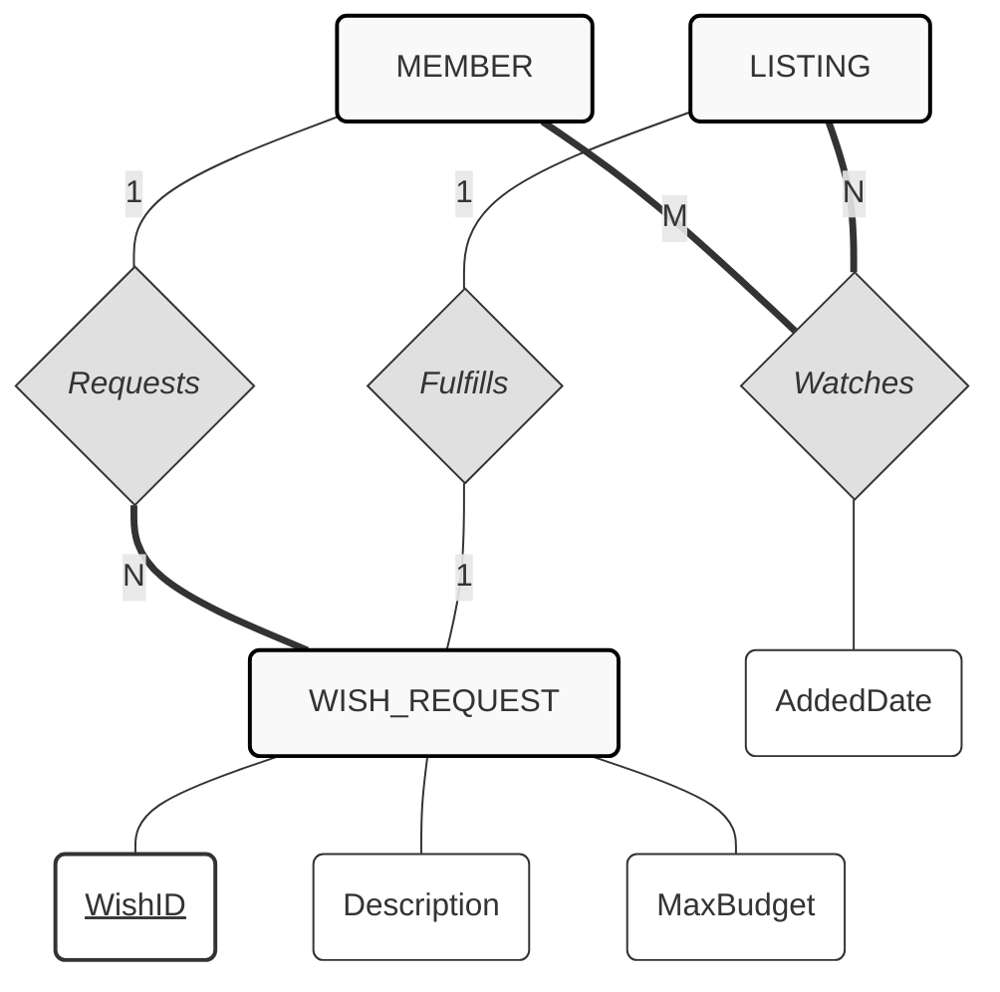
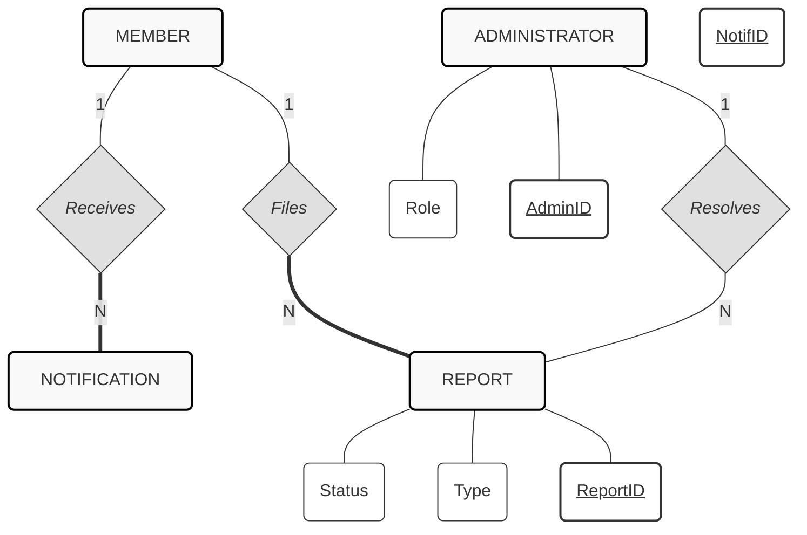

# ER Diagrams 

This document contains the complete report for the marketplace schema broken down into functionality-specific ER diagrams. Each section includes the key logic and the Mermaid diagram.

## Table of Contents

1. [ER diagram for complete schema](#complete-er-diagram)
2. [Listing & Categorization Module](#listing--categorization-module)
3. [Transaction & Offers Module (Core Marketplace)](#transaction--offers-module-core-marketplace)
4. [Communication Module](#communication-module)
5. [Engagement Module (Wishes & Watchlist)](#engagement-module-wishes--watchlist)
6. [Moderation & Admin Module](#moderation--admin-module)

---

## 1. ER diagram for complete schema

## Breakdown of Complete Schema into Functionality-Specific ER Diagrams

In this section, we will break down the complete schema into smaller ER diagrams based on specific functionalities. Each diagram will focus on a particular module, providing a clearer understanding of the relationships and entities involved.

## 2. Listing & Categorization Module

**Key Logic:**

* A **Member** posts a **Listing**.
* A **Listing** must belong to a **Category**.
* Categories can have sub-categories (recursive relationship).
* A **Listing** can have multiple **Images** (weak entity).

---

## 3. Transaction & Offers Module (Core Marketplace)

**Key Logic:**

* A **Member** (Buyer) makes an **Offer** on a **Listing**.
* If accepted, the **Offer** becomes a **Transaction**.
* Alternatively, a **Listing** can directly generate a **Transaction**.
* Once a **Transaction** is done, users leave a **Rating**.

---

## 4. Communication Module

**Key Logic:**

* A **Message Thread** is specific to a Buyer and a Listing.
* A **Message** is a weak entity (cannot exist without a thread).

---

## 5. Engagement Module (Wishes & Watchlist)

**Key Logic:**

* **Watchlist:** A Many-to-Many relationship between Member and Listing.
* **Wish Request:** A Member requests an item; a new Listing can fulfill that request.

---

## 6. Moderation & Admin Module

**Key Logic:**

* **Members** file **Reports** (against listings or other users).
* **Admins** resolve **Reports**.
* **Members** receive **Notifications**.

