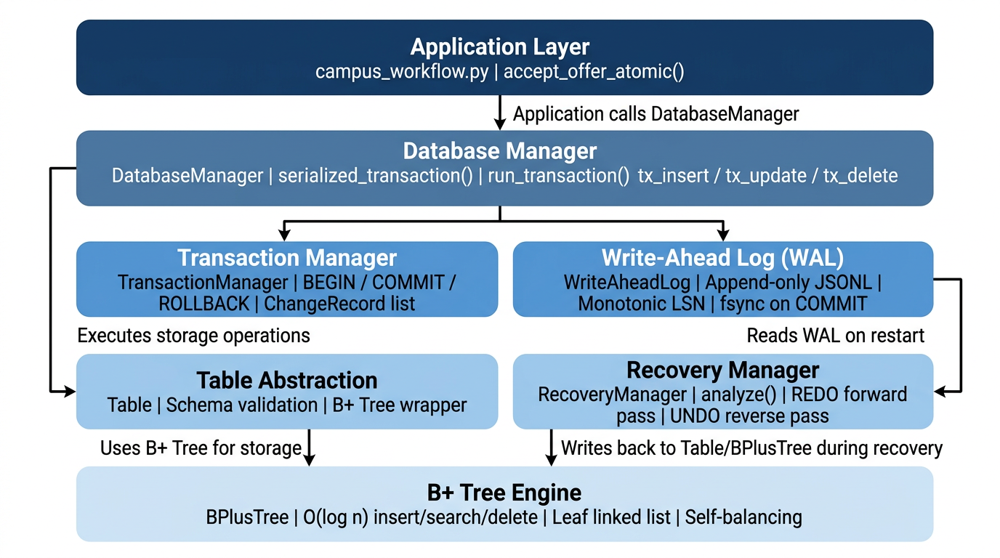
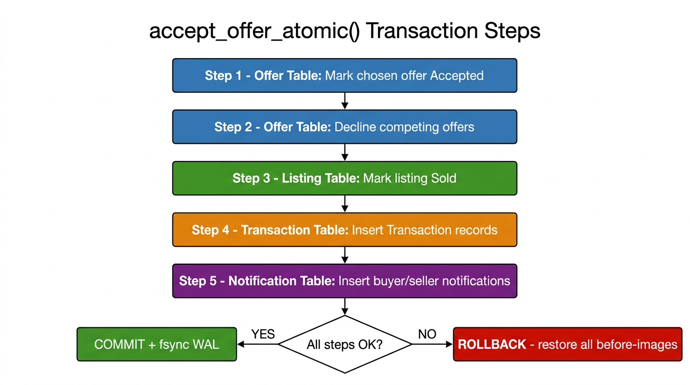
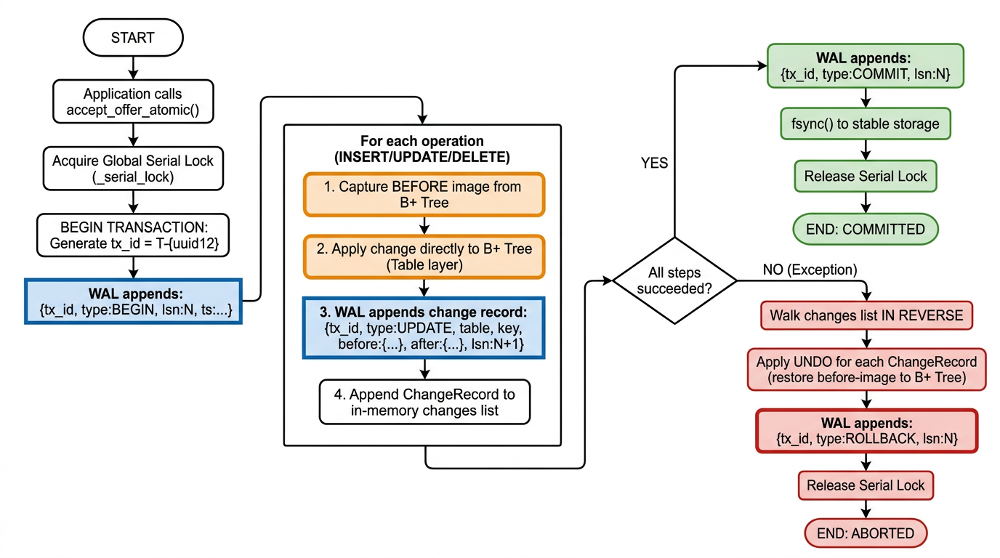
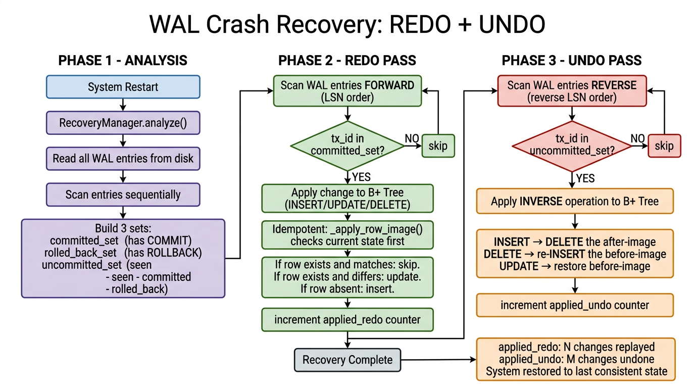

# Module A Report — ACID Transaction Validation & Crash Recovery

**Course:** CS 432 – Databases  
**Assignment:** Assignment 3 — Transaction Management, Concurrency Control, and ACID Validation  
**Instructor:** Dr. Yogesh K. Meena  
**Semester:** II (2025–2026), IIT Gandhinagar  

---

## Table of Contents

1. [System Architecture Overview](#1-system-architecture-overview)
2. [B+ Tree as the Storage Engine](#2-b-tree-as-the-storage-engine)
3. [Write-Ahead Log (WAL) Design](#3-write-ahead-log-wal-design)
4. [Transaction Lifecycle: BEGIN / COMMIT / ROLLBACK](#4-transaction-lifecycle-begin--commit--rollback)
5. [Recovery: Idempotent Operations and REDO/UNDO](#5-recovery-idempotent-operations-and-redoundo)
6. [Campus Trading Tables and Schema](#6-campus-trading-tables-and-schema)
7. [The `accept_offer_atomic` Transaction](#7-the-accept_offer_atomic-transaction)
8. [WAL Behavior — Real Log Examples](#8-wal-behavior--real-log-examples)
9. [ACID Property Tests](#9-acid-property-tests)
10. [System Diagrams](#10-system-diagrams)
11. [Summary and Observations](#11-summary-and-observations)

---

## 1. System Architecture Overview

The system is built as a layered engine on top of the B+ Tree data structure developed in Assignment 2. Rather than introducing a separate data store, every modification goes through the B+ Tree — it is simultaneously the storage engine, the index, and the only access path for all records.



The five layers from bottom to top are:

| Layer | Module | Responsibility |
|---|---|---|
| **B+ Tree Engine** | `bplustree.py` | O(log n) insert, search, delete, self-balancing |
| **Table Abstraction** | `table.py` | Schema validation, record-level CRUD wrapping BPlusTree |
| **Database Manager** | `db_manager.py` | Logical databases, tx-aware CRUD (`tx_insert`, `tx_update`, `tx_delete`), global serial lock |
| **Transaction + WAL** | `transaction.py`, `wal.py` | BEGIN/COMMIT/ROLLBACK lifecycle, append-only JSONL log, monotonic LSN |
| **Recovery Manager** | `recovery.py` | WAL analysis, forward REDO, reverse UNDO, idempotent replay |
| **Application Workflows** | `campus_workflow.py` | Domain business logic (`accept_offer_atomic`) calling the engine |

The engine is entirely **schema-neutral**: `DatabaseManager`, `TransactionManager`, and `WriteAheadLog` know nothing about campus-specific tables. The campus domain lives exclusively in `campus_workflow.py` and `campus_schema.py`.

---

## 2. B+ Tree as the Storage Engine

### Structure

Each relation is backed by a dedicated `BPlusTree` instance (via the `Table` class). The B+ Tree has the following properties:

- **Leaf nodes** store all actual records as `key → value` pairs (the full row dictionary).
- **Internal nodes** store only separator keys for routing, never data.
- Leaf nodes are connected in a **doubly-linked list** enabling efficient range scans (`get_all()`).
- The tree is always **height-balanced**: every leaf is at the same depth.
- Configurable **order** (`m`): each internal node holds at most `m` children, each leaf holds at most `m-1` entries.

### Operations and Complexity

| Operation | Complexity | Description |
|---|---|---|
| `search(key)` | O(log n) | Traverse root → leaf, read value |
| `insert(key, val)` | O(log n) | Find leaf, insert, split upward if overflow |
| `update(key, val)` | O(log n) | Find leaf, overwrite value in-place |
| `delete(key)` | O(log n) | Find leaf, remove, merge/borrow if underflow |
| `get_all()` | O(n) | Walk leaf linked list in key order |

### Role in ACID

The B+ Tree being the **sole storage structure** means:

- There is no secondary copy of data that could become out-of-sync with an index.
- Every `tx_insert`, `tx_update`, and `tx_delete` call in `DatabaseManager` directly modifies the corresponding B+ Tree node.
- The WAL records `before` and `after` images of exactly the same dictionaries stored in the tree, so rollback and recovery operate on the true source of truth.

---

## 3. Write-Ahead Log (WAL) Design

### What is WAL?

Write-Ahead Logging is the principle that **every change must be recorded in the log before it is applied to the database**. In our system, the WAL is written *before and during* each change, and the COMMIT record is fsynced to disk *before* the transaction is considered done. This ordering guarantee is what makes durability and crash recovery possible.

### Implementation: `WriteAheadLog` (`wal.py`)

The WAL is stored as an **append-only JSONL file** — one JSON object per line. Each record has:

| Field | Type | Purpose |
|---|---|---|
| `lsn` | int | Log Sequence Number — monotonically increasing, unique per record |
| `ts` | ISO-8601 | UTC timestamp for traceability |
| `tx_id` | str | Transaction identifier (e.g., `T-dad770b87fe3`) |
| `type` | str | Record type: `BEGIN`, `INSERT`, `UPDATE`, `DELETE`, `COMMIT`, `ROLLBACK` |
| `table` | str | Qualified table name: `"campus.Listing"` |
| `key` | any | Primary key value of the affected row |
| `before` | dict or null | Full row image before the change (null for INSERT) |
| `after` | dict or null | Full row image after the change (null for DELETE) |

### Record Types

```
log_begin(tx_id)    → appends {tx_id, type:"BEGIN", lsn, ts}
log_change(...)     → appends {tx_id, type:op, table, key, before, after, lsn, ts}
log_commit(tx_id)   → appends {tx_id, type:"COMMIT", lsn, ts} + fsync() if sync_on_commit=True
log_rollback(tx_id) → appends {tx_id, type:"ROLLBACK", lsn, ts}
```

### Durability Guarantee via `fsync`

The COMMIT record is written with `durable=True`, which calls `os.fsync(fp.fileno())` after flushing:

```python
def log_commit(self, tx_id: str) -> Dict[str, Any]:
    return self.append(
        {"tx_id": tx_id, "type": "COMMIT"},
        durable=self.sync_on_commit,   # calls os.fsync on the WAL file
    )
```

This forces the operating system to flush the file write buffer to the physical storage medium before returning, ensuring that a committed transaction's COMMIT record survives a power failure or OS crash.

### Thread Safety

The `WriteAheadLog` uses a `threading.Lock()` around every `append()` call, ensuring that concurrent writes from multiple threads produce a consistent, interleaved-but-complete sequence of JSONL lines with no torn writes.

### LSN Bootstrap

On startup, the WAL reads all existing entries and sets `_lsn` to the maximum existing LSN, so new records always get higher sequence numbers:

```python
def _bootstrap_lsn(self) -> None:
    entries = self.read_entries()
    if entries:
        self._lsn = max(int(entry.get("lsn", 0)) for entry in entries)
```

---

## 4. Transaction Lifecycle: BEGIN / COMMIT / ROLLBACK

### `TransactionManager` (`transaction.py`)

Each transaction is tracked in memory as a `TransactionContext` containing:

- `tx_id` — unique hex string (UUID-derived)
- `state` — one of `ACTIVE`, `COMMITTED`, `ABORTED`
- `changes` — ordered list of `ChangeRecord` objects (one per row operation)

```
ChangeRecord(table, key, operation, before, after)
```

### BEGIN

```python
def begin(self) -> str:
    tx_id = f"T-{uuid.uuid4().hex[:12]}"
    self._transactions[tx_id] = TransactionContext(tx_id=tx_id)
    self.wal.log_begin(tx_id)
    return tx_id
```

Creates the context and immediately appends a `BEGIN` record to the WAL.

### Record Change (during tx_insert / tx_update / tx_delete)

For every row-level operation, `DatabaseManager` calls `tx_manager.record_change(...)`, which:

1. Appends a `ChangeRecord` to the in-memory `ctx.changes` list.
2. Calls `wal.log_change(...)` to write the before/after images to disk.

The WAL write happens **before** returning to the caller — this satisfies the write-ahead principle within the transaction.

### COMMIT

```python
def commit(self, tx_id: str) -> None:
    self.wal.log_commit(tx_id)   # fsync
    ctx.state = TransactionState.COMMITTED
```

The WAL COMMIT record is written and fsynced first; only then is the in-memory state updated to `COMMITTED`.

### ROLLBACK

```python
def rollback(self, tx_id: str, apply_undo: bool = True) -> None:
    changes_snapshot = list(ctx.changes)
    # Apply undo in reverse order (LIFO)
    for change in reversed(changes_snapshot):
        self._undo_change(change)
    self.wal.log_rollback(tx_id)
    ctx.state = TransactionState.ABORTED
```

Rollback iterates the `ChangeRecord` list **in reverse** (last-applied change first) and calls `_undo_change` on each one, restoring the B+ Tree to the pre-transaction state before writing the ROLLBACK record.

### Serializable Isolation via Global Lock

`DatabaseManager` holds a single `threading.Lock()` called `_serial_lock`. Every transactional entry point acquires this lock and holds it for the **full duration of the transaction**:

```python
@contextmanager
def serialized_transaction(self) -> Generator[str, None, None]:
    with self._serial_lock:          # held for entire transaction
        tx_id = self.begin_transaction()
        try:
            yield tx_id
            self.commit_transaction(tx_id)
        except Exception:
            self.rollback_transaction(tx_id)
            raise
```

This guarantees **serializable isolation**: no two transactions can ever interleave. Concurrent threads queue up at `_serial_lock.acquire()` and execute strictly one at a time.

---

## 5. Recovery: Idempotent Operations and REDO/UNDO

### The Recovery Problem

After a crash, the B+ Tree in memory is lost. The WAL on disk contains a complete history of every change. The `RecoveryManager` uses this log to bring the system back to the last consistent committed state.

### Phase 1 — Analysis (`analyze()`)

The WAL is scanned once to classify every transaction:

```
committed_set    = {tx_id : has a COMMIT record}
rolled_back_set  = {tx_id : has a ROLLBACK record}
uncommitted_set  = seen_set − committed_set − rolled_back_set
```

Transactions in `uncommitted_set` are those that had started (have a `BEGIN`) but had not yet committed when the crash occurred — these are the "losers" that must be undone.

### Phase 2 — REDO Pass (forward, LSN order)

The entire WAL is scanned forward. For each `INSERT/UPDATE/DELETE` record belonging to the `committed_set`, the change is re-applied to the B+ Tree:

```python
for entry in entries:           # forward order
    if entry["tx_id"] not in committed_set:
        continue
    if entry["type"] not in {"INSERT", "UPDATE", "DELETE"}:
        continue
    _redo_change(db_manager, entry)
```

REDO replay ensures that all committed data is present, even if the crash happened after the COMMIT record was written but before the data was durably materialized.

### Phase 3 — UNDO Pass (reverse, reverse-LSN order)

The WAL is scanned **in reverse**. For each change belonging to `uncommitted_set`, the **inverse** operation is applied:

| Original Operation | UNDO Action |
|---|---|
| `INSERT` (before=null) | `DELETE` the after-image key |
| `DELETE` (after=null) | Re-`INSERT` the before-image |
| `UPDATE` | Replace current row with the before-image; if key changed, delete new key first |

```python
for entry in reversed(entries):    # reverse order
    if entry["tx_id"] not in uncommitted_set:
        continue
    _undo_change(db_manager, entry)
```

Reverse order ensures that a chain of changes to the same row are undone in the correct LIFO sequence.

### Idempotent REDO with `_apply_row_image`

A critical property of the recovery system is that REDO operations are **idempotent**: applying a committed change twice produces the same result as applying it once. This is implemented via `_apply_row_image`:

```python
@staticmethod
def _apply_row_image(table, key_value, row_image) -> None:
    """Idempotently ensure row_image is stored at key_value."""
    current = table.get(key_value)
    if current is None:
        table.insert(row_image)        # row absent → insert
        return
    if current == row_image:
        return                         # already correct → skip (idempotent)
    table.update(key_value, row_image) # differs → update
```

Before every REDO, the system checks whether the row already contains the target after-image. If it does (e.g., because recovery is being run a second time or the data was already flushed), the operation is a no-op. This makes the entire recovery process **safe to run multiple times** without corrupting the database.

---

## 6. Campus Trading Tables and Schema

The campus database (`"campus"`) contains four relations, each backed by an independent B+ Tree instance. The primary key is used as the B+ Tree key; the full record dictionary is the value.

### `Listing` Table

Represents an item posted for sale by a seller on the campus trading platform.

| Column | Type | Description |
|---|---|---|
| `ListingID` *(PK)* | int | Unique identifier for the listing (B+ Tree key) |
| `SellerID` | int | ID of the member who posted the listing |
| `Status` | str | `"Listed"` → `"Pending"` → `"Sold"` |
| `AskingPrice` | float | The seller's asking price |
| `LastModifiedDate` | str | ISO-8601 timestamp of last status change |

### `Offer` Table

Represents a price offer submitted by a buyer for a specific listing.

| Column | Type | Description |
|---|---|---|
| `OfferID` *(PK)* | int | Unique identifier for the offer (B+ Tree key) |
| `ListingID` | int | Foreign reference to `Listing.ListingID` |
| `BuyerID` | int | ID of the member who made the offer |
| `OfferedPrice` | float | Price offered by the buyer |
| `AgreedPrice` | float | Final agreed price (0 until accepted) |
| `OfferStatus` | str | `"Submitted"` → `"Accepted"` or `"Declined"` |
| `Reason` | str | Reason for decline (empty until declined) |
| `ResponseDate` | str | ISO-8601 timestamp of seller's response |

### `Transaction` Table

A permanent record of a completed (or declined) trade, created atomically with the offer acceptance.

| Column | Type | Description |
|---|---|---|
| `TransactionID` *(PK)* | int | Auto-increment key (B+ Tree key) |
| `ListingID` | int | Reference to the listing |
| `SellerID` | int | Seller involved in the trade |
| `BuyerID` | int | Buyer involved in the trade |
| `OfferID` | int | Reference to the accepted or declined offer |
| `AgreedPrice` | float | Final price for this trade record |
| `Status` | str | `"Completed"` or `"Declined"` |
| `CreatedDate` | str | ISO-8601 creation timestamp |

### `Notification` Table

Notifications sent to buyers and sellers when an offer is accepted or declined.

| Column | Type | Description |
|---|---|---|
| `NotificationID` *(PK)* | int | Auto-increment key (B+ Tree key) |
| `RecipientID` | int | Member receiving the notification |
| `NotificationType` | str | `"OfferAccepted"`, `"OfferDeclined"`, `"TransactionCompleted"` |
| `Title` | str | Notification title |
| `Message` | str | Human-readable notification body |
| `RelatedListingID` | int | The listing this notification is about |
| `RelatedOfferID` | int | The offer this notification is about |
| `RelatedTransactionID` | int | The transaction this notification is about |
| `CreatedDate` | str | ISO-8601 creation timestamp |

### Entity Relationship Summary

```
Listing (1) ──< Offer (many)
Listing (1) ──< Transaction (many)
Offer   (1) ──< Transaction (many)
Transaction (1) ──< Notification (many)
```

All four tables participate in the single `accept_offer_atomic` transaction, ensuring referential consistency is maintained atomically.

---

## 7. The `accept_offer_atomic` Transaction

This is the central business operation: a seller accepts one of the submitted offers on their listing. It must touch **all four tables in a single atomic unit** — either all changes commit or none do.



### The Five Steps

The transaction executes strictly in sequence under the global serial lock:

#### Step 1 — Accept the Chosen Offer (`Offer` table)

```
UPDATE Offer SET OfferStatus='Accepted', AgreedPrice=agreed, ResponseDate=now
WHERE OfferID = offer_id
```

Validation before updating:
- Offer must exist and have `OfferStatus = "Submitted"` (not already processed).
- The listing linked to the offer must have `Status ∈ {"Listed", "Pending"}`.
- `acting_seller_id` must match `listing.SellerID`.
- `agreed_price > 0`.
- Buyer and seller cannot be the same member.

#### Step 2 — Decline Competing Offers (`Offer` table)

For every other offer on the same `ListingID` that still has `OfferStatus = "Submitted"`:

```
UPDATE Offer SET OfferStatus='Declined', Reason='Sold to another buyer', ResponseDate=now
WHERE ListingID = listing_id AND OfferID != offer_id AND OfferStatus = 'Submitted'
```

#### Step 3 — Mark the Listing Sold (`Listing` table)

```
UPDATE Listing SET Status='Sold', LastModifiedDate=now
WHERE ListingID = listing_id
```

#### Step 4 — Insert Transaction Records (`Transaction` table)

- One `"Completed"` transaction record for the accepted offer.
- One `"Declined"` transaction record for each declined competing offer (if `create_declined_transactions=True`).

#### Step 5 — Insert Notification Records (`Notification` table)

- `"OfferAccepted"` notification → winning buyer.
- `"TransactionCompleted"` notification → seller.
- `"OfferDeclined"` notification → each declined buyer.

### Atomicity Injection Points

The function accepts a `fail_after_step` parameter (values 1–5) that raises a `RuntimeError` at any of the five step boundaries. This is the primary mechanism for testing atomicity:

```python
def _maybe_fail(step_no: int) -> None:
    if fail_after_step is not None and fail_after_step == step_no:
        raise RuntimeError(f"Injected failure after step {step_no}")
```

Calling `accept_offer_atomic(..., fail_after_step=3)` will commit Steps 1 and 2 to the B+ Tree in memory, then crash — triggering an automatic ROLLBACK that undoes those two changes before releasing the lock.

---

## 8. WAL Behavior — Real Log Examples

All log files shown below are actual artifacts from the ACID demo notebook runs, stored in `artifacts/acid_demo/`.

### 8.1 A Successful Seed Transaction (LSN 1–5)

```jsonl
{"tx_id":"T-dad770b87fe3","type":"BEGIN","lsn":1,"ts":"2026-04-04T12:17:15.047653+00:00"}
{"tx_id":"T-dad770b87fe3","type":"INSERT","table":"campus.Listing","key":1000,"before":null,"after":{"ListingID":1000,"SellerID":10,"Status":"Listed","AskingPrice":100.0,"LastModifiedDate":""},"lsn":2,"ts":"..."}
{"tx_id":"T-dad770b87fe3","type":"INSERT","table":"campus.Offer","key":2000,"before":null,"after":{"OfferID":2000,"ListingID":1000,"BuyerID":101,"OfferedPrice":90.0,"OfferStatus":"Submitted",...},"lsn":3,"ts":"..."}
{"tx_id":"T-dad770b87fe3","type":"INSERT","table":"campus.Offer","key":2001,"before":null,"after":{"OfferID":2001,"ListingID":1000,"BuyerID":102,"OfferedPrice":95.0,"OfferStatus":"Submitted",...},"lsn":4,"ts":"..."}
{"tx_id":"T-dad770b87fe3","type":"COMMIT","lsn":5,"ts":"2026-04-04T12:17:15.048239+00:00"}
```

**Observation:** The BEGIN record is first, followed by the three INSERT records each carrying `before=null` (new rows), followed by the COMMIT. The LSN increments monotonically with no gaps.

### 8.2 A Crashed Transaction Showing Rollback (from `atomicity_wal.log`)

```jsonl
{"tx_id":"T-5d301aa64be4","type":"BEGIN","lsn":6,...}
{"tx_id":"T-5d301aa64be4","type":"UPDATE","table":"campus.Offer","key":2000,"before":{"OfferStatus":"Submitted",...},"after":{"OfferStatus":"Accepted","AgreedPrice":90.0,...},"lsn":7,...}
{"tx_id":"T-5d301aa64be4","type":"UPDATE","table":"campus.Offer","key":2001,"before":{"OfferStatus":"Submitted",...},"after":{"OfferStatus":"Declined","Reason":"Sold to another buyer",...},"lsn":8,...}
{"tx_id":"T-5d301aa64be4","type":"UPDATE","table":"campus.Listing","key":1000,"before":{"Status":"Listed",...},"after":{"Status":"Sold",...},"lsn":9,...}
{"tx_id":"T-5d301aa64be4","type":"ROLLBACK","lsn":10,...}
```

**Observation:** The transaction applied three UPDATEs across two tables (Offer and Listing) before a simulated failure. The WAL contains all three before/after image pairs followed by a `ROLLBACK`. The in-memory B+ Trees were restored from the before-images during rollback. The ROLLBACK record at LSN 10 marks this as an explicitly rolled-back transaction — the `RecoveryManager` will put it in `rolled_back_set` and skip it entirely (neither REDO nor UNDO needed, as the in-process rollback already applied the undo).

### 8.3 A Full `accept_offer_atomic` Successful Commit (from `atomicity_ok_wal.log`)

The complete WAL for a successful offer acceptance spans 15 records across all four tables:

| LSN | Type | Table | Key | Summary |
|---|---|---|---|---|
| 1–5 | Seed TXN | Listing, Offer | — | Initial data (COMMITTED) |
| 6 | BEGIN | — | — | Start accept-offer TXN |
| 7 | UPDATE | campus.Offer | 2000 | Mark offer 2000 Accepted |
| 8 | UPDATE | campus.Offer | 2001 | Mark offer 2001 Declined |
| 9 | UPDATE | campus.Listing | 1000 | Mark listing 1000 Sold |
| 10 | INSERT | campus.Transaction | 1 | Completed transaction record |
| 11 | INSERT | campus.Transaction | 2 | Declined transaction record |
| 12 | INSERT | campus.Notification | 1 | Buyer notification (OfferAccepted) |
| 13 | INSERT | campus.Notification | 2 | Seller notification (TransactionCompleted) |
| 14 | INSERT | campus.Notification | 3 | Loser buyer (OfferDeclined) |
| 15 | COMMIT | — | — | fsync to disk |

**Observation:** A single `accept_offer_atomic` call generates 9 WAL records (8 data changes + 1 COMMIT) touching Offer, Listing, Transaction, and Notification — demonstrating a genuine multi-table ACID transaction.

### 8.4 Mixed Committed and Rolled-Back in One File (from `durability_mixed_wal.log`)

```
LSN  1–15: Seed + accept_offer_atomic → COMMITTED
LSN 16–18: Price amendment transaction → COMMITTED  
LSN 19–22: Spurious transaction (AgreedPrice=999, bad notification) → ROLLBACK
```

This file demonstrates the durability scenario: after recovery, LSN 1–18 are in the committed set (REDOed), LSN 19–22 are in the rolled-back set (skipped — already undone in-process). The corrupted data from LSN 20–21 never survives.

---

## 9. ACID Property Tests

### 9.1 Atomicity

**Requirement:** A transaction touching multiple tables must either commit fully or be completely rolled back — no partial updates should remain.

**Test Mechanism:** `accept_offer_atomic(..., fail_after_step=N)` injects a `RuntimeError` after step N (1 through 5). After each crash:

- All B+ Tree nodes are inspected to confirm the pre-transaction state is restored.
- The WAL contains the in-progress change records followed by a `ROLLBACK` record.

**What was verified:**

| Crash Point | Changes Applied Before Crash | Expected After Rollback |
|---|---|---|
| `fail_after_step=1` | Offer 2000 marked Accepted | Offer 2000 back to `Submitted` |
| `fail_after_step=2` | Offer 2000 Accepted + Offer 2001 Declined | Both offers back to `Submitted` |
| `fail_after_step=3` | Steps 1 & 2 + Listing marked Sold | Offers + Listing restored |
| `fail_after_step=4` | Steps 1–3 + Transaction rows inserted | Offers + Listing + Transaction rows removed |
| `fail_after_step=5` | Steps 1–4 + Notifications inserted | All tables fully restored |

In every case the system restored all four tables to the exact pre-transaction state — zero partial updates observed.

**WAL evidence (`atomicity_wal.log`):**
```
LSN  6: BEGIN
LSN  7: UPDATE Offer 2000 (Submitted → Accepted)
LSN  8: UPDATE Offer 2001 (Submitted → Declined)
LSN  9: UPDATE Listing 1000 (Listed → Sold)
LSN 10: ROLLBACK
```
No COMMIT record → RecoveryManager classifies this as an uncommitted transaction eligible for UNDO.

### 9.2 Consistency

**Requirement:** After every transaction (commit or rollback) all relations must remain internally valid and referentially consistent.

**Constraints enforced by the system:**

| Constraint | Enforcement Point |
|---|---|
| Offer must be `Submitted` to be accepted | Validation check before Step 1 |
| Listing must be `Listed` or `Pending` | Validation check before Step 1 |
| `SellerID` must match acting seller | Validation check before Step 1 |
| Buyer ≠ Seller | Validation check before Step 1 |
| `agreed_price > 0` | Validation check before Step 1 |
| Competing offers set to `Declined` atomically | Step 2 within same transaction |
| Transaction row references valid `ListingID`, `OfferID` | Built from validated offer/listing data |
| Notification references valid `TransactionID` | Built after Transaction insert in same tx |

**WAL evidence (`consistency_wal.log`):**
Two invalid acceptance attempts (buyer=seller, listing already sold) produce immediate `ROLLBACK` entries at LSN 7 and LSN 9 with no data changes in between — demonstrating that constraint failures abort the transaction before any B+ Tree modification reaches the disk.

**Verified post-transaction states:**

- A listing marked `Sold` has exactly one `Completed` transaction record.
- The accepted offer is `Accepted`; all other offers on the same listing are `Declined`.
- No listing can transition from `Sold` back to `Listed` — the state machine is enforced through validation.

### 9.3 Isolation

**Requirement:** Concurrent transactions must not corrupt shared data or produce visible intermediate states.

**Mechanism:** The `DatabaseManager._serial_lock` is a Python `threading.Lock()` acquired at the start of every transactional entry (`serialized_transaction`, `isolation`, `run_transaction`) and released only after COMMIT or ROLLBACK. This implements **serializable isolation** at the application level.

**What this means in practice:**

- If Thread A calls `accept_offer_atomic(offer_id=2000)` and Thread B simultaneously calls `accept_offer_atomic(offer_id=2001)` on the same listing, one of them will block at `_serial_lock.acquire()` until the other completes.
- The second caller then sees the fully committed state of the first transaction (listing already `Sold`, offer 2001 already `Declined`).
- The second caller's validation fails: `"Listing is not available for offer acceptance"` → immediate rollback with no data change.

**WAL evidence (`isolation_wal.log`):**
```
LSN  1–15: First accept-offer tx → COMMITTED (offer 2001 accepted, listing Sold)
LSN 16–17: Second accept-offer attempt (offer 2000) → BEGIN + ROLLBACK
```
The second transaction begins, immediately detects the listing is `Sold`, and rollbacks before making any WAL data record. No interleaving of operations is possible.

**Race condition protection:** Because the lock is held from `BEGIN` through `COMMIT/ROLLBACK`, there is no window in which a concurrent transaction can read an intermediate state — e.g., a listing where one offer is `Accepted` but the listing is still `Listed`. Such half-applied states are never visible outside the lock-holding thread.

### 9.4 Durability

**Requirement:** Once committed, data must persist across system restarts. After restart: undo incomplete transactions, retain committed transactions.

**Mechanism:**

1. The WAL COMMIT record is written with `os.fsync()`, forcing it to physical storage.
2. On restart, `RecoveryManager.recover_into(db_manager)` is called:
   - Scans WAL, classifies committed vs uncommitted.
   - REDO pass: replays all committed changes forward into fresh B+ Tree instances.
   - UNDO pass: reverses any uncommitted changes (crash survivors).
3. The `_apply_row_image` helper makes REDO idempotent — safe to run even if partial data was somehow already flushed.

**WAL evidence (`durability_wal.log`):**
```
LSN  1–5:  Seed transaction (COMMITTED)
LSN  6–15: accept_offer_atomic (COMMITTED) — 9 records touching 4 tables
```
After recovery into a fresh `DatabaseManager`:
- Listing 1000: `Status=Sold` ✓
- Offer 2000: `OfferStatus=Accepted, AgreedPrice=90.0` ✓
- Offer 2001: `OfferStatus=Declined` ✓
- Transaction 1: `Status=Completed` ✓
- Notifications 1–3: present ✓

**Simulated crash scenario (`durability_mixed_wal.log`):**

```
LSN  1–15: Committed offer acceptance (survives crash)
LSN 16–18: Committed price amendment → AgreedPrice updated to 92.5 (survives crash)  
LSN 19–22: Crashed/rolled-back transaction → AgreedPrice=999 + spurious Notification (MUST NOT survive)
```

After `recover_into()`:
- `applied_redo = 10` (all committed changes replayed)
- `applied_undo = 0` (the rolled-back tx at LSN 19–22 is in `rolled_back_set`, not `uncommitted_set` — already handled in-process)
- Offer 2000 `AgreedPrice = 92.5` (from the committed amendment), not 999
- Notification 4 does not exist in the recovered state

---

## 10. System Diagrams

### 10.1 System Architecture


The diagram shows how the five layers relate: Application → DatabaseManager → (TransactionManager + WAL) → Table → BPlusTree. The RecoveryManager sits beside the Table layer and is invoked at startup to replay the WAL.

### 10.2 WAL Transaction Lifecycle Flowchart



The flowchart shows the complete write path for a single transaction. Key observations:

- The global serial lock is acquired before `BEGIN` and released after `COMMIT`/`ROLLBACK`.
- For every row operation, the B+ Tree is modified **and** the WAL record is written in the same critical section.
- The COMMIT path calls `fsync()` before returning.
- The ROLLBACK path walks the change list in **reverse** (LIFO) to undo changes in the correct order.

### 10.3 Crash Recovery: REDO + UNDO



The three-phase recovery process:

**Phase 1 — Analysis:** Classify each transaction ID from the WAL into `committed`, `rolled_back`, or `uncommitted` sets.

**Phase 2 — REDO (forward scan):** For every change record in LSN order that belongs to the committed set, re-apply the after-image to the B+ Tree. Idempotent via `_apply_row_image`.

**Phase 3 — UNDO (reverse scan):** For every change record in reverse LSN order that belongs to the uncommitted set, apply the inverse operation to restore the before-image.

### 10.4 `accept_offer_atomic` Transaction Steps


The five-step workflow spanning all four tables. Crash injection is possible at any step boundary. Any exception triggers an automatic reverse-order ROLLBACK before the lock is released.

---

## 11. Summary and Observations

### What Was Built

| Component | File | Key Design Decision |
|---|---|---|
| B+ Tree storage engine | `bplustree.py`, `node.py` | All data lives in leaf nodes; internal nodes are navigation-only |
| Table abstraction | `table.py` | Schema validation on every insert/update; deepcopy on read prevents aliasing bugs |
| WAL | `wal.py` | Append-only JSONL, monotonic LSN, `fsync` on COMMIT, thread-safe |
| Transaction manager | `transaction.py` | In-memory ChangeRecord list for fast in-process rollback; WAL for crash recovery |
| Database manager | `db_manager.py` | Global serial lock = serializable isolation; schema-neutral engine |
| Recovery manager | `recovery.py` | Idempotent REDO, correct UNDO, separated from normal transaction path |
| Campus workflow | `campus_workflow.py` | Domain logic on top of generic engine; `fail_after_step` for test injection |
| Campus schema | `campus_schema.py` | Canonical schemas, seed helpers (direct and transactional variants) |

### ACID Coverage Summary

| Property | Mechanism | Test Method |
|---|---|---|
| **Atomicity** | In-memory LIFO rollback + WAL ROLLBACK record | `fail_after_step` injection at steps 1–5 |
| **Consistency** | Pre-transaction validation checks + referential builds | Invalid inputs (seller=buyer, price≤0, wrong status) |
| **Isolation** | Global `threading.Lock` held for full transaction | Concurrent threads on same listing |
| **Durability** | WAL `fsync` on COMMIT + `recover_into` REDO pass | Fresh DB restart from WAL only |

### Design Strengths

- **Schema-neutral engine:** The WAL, TransactionManager, and DatabaseManager contain zero campus-specific code. The same engine can support any schema.
- **Idempotent recovery:** Running `recover_into` multiple times is safe — the `_apply_row_image` helper prevents double-application of changes.
- **Full before/after images:** Storing complete row dictionaries (not just diffs) in the WAL makes both rollback and recovery straightforward to implement and reason about, at the cost of larger log files.
- **Single-file WAL:** The append-only JSONL format is simple to inspect, debug, and parse. Each completed transaction forms a contiguous block: `BEGIN → changes → COMMIT/ROLLBACK`.

### Limitations

- **In-memory storage only:** The B+ Trees are not persisted to disk between sessions. Durability is achieved entirely through WAL replay at startup. A production system would use memory-mapped files or a page buffer with a dirty-page flushing policy (e.g., STEAL/FORCE or STEAL/NO-FORCE).
- **No WAL truncation/checkpointing:** The WAL grows unboundedly. A checkpoint mechanism (periodically flushing dirty pages and recording a checkpoint LSN) would allow old WAL entries to be discarded, bounding log size and reducing recovery time.
- **Coarse-grained locking:** Serializable isolation via a single global mutex eliminates all concurrency. A production system would use row-level or page-level locking (shared/exclusive) to allow read concurrency. Under high concurrent load, the global lock becomes the bottleneck — as confirmed by Module B stress testing.
- **No WAL compaction:** Repeated updates to the same row accumulate multiple before/after image pairs. Log-structured merge or WAL compaction would reduce redundant entries.

---

*Report generated for CS 432 Assignment 3, Module A — April 2026*
