# Module B — Multi-User Behaviour and Stress Testing
## Campus Trading Application (MySQL / Go Backend)

> **Test run ID:** `34e0e4` · Generated: 2026-04-04 UTC  
> **Overall result: ✅ ALL 4 SCENARIOS PASSED**

---

## Table of Contents

1. [System Under Test](#1-system-under-test)
2. [Test Architecture](#2-test-architecture)
3. [Scenario 1 — Concurrent Usage](#3-scenario-1--concurrent-usage)
4. [Scenario 2 — Race Condition Testing](#4-scenario-2--race-condition-testing)
5. [Scenario 3 — Failure Simulation](#5-scenario-3--failure-simulation)
6. [Scenario 4 — Stress Testing](#6-scenario-4--stress-testing)
7. [ACID Verification Summary](#7-acid-verification-summary)
8. [Performance Summary](#8-performance-summary)
9. [Observations and Limitations](#9-observations-and-limitations)

---

## 1. System Under Test

The Campus Trading Application is a real-world marketplace built for students to list, offer, and trade items.

| Component        | Technology                            |
|-----------------|---------------------------------------|
| Backend API      | Go (Chi router) — port 8080           |
| Database         | MySQL 8.0 (InnoDB) in Docker          |
| Container name   | `campus_a3_mysql`                     |
| Test framework   | Custom Python 3 suite (no third-party load tool) |
| Monitoring       | `docker stats` polled every 1 s       |

### Key API endpoints exercised

| Method | Endpoint                          | Operation              |
|--------|-----------------------------------|------------------------|
| POST   | `/auth/register`                  | Register user          |
| POST   | `/auth/login`                     | Login (session cookie) |
| GET    | `/listings`                       | List marketplace items |
| POST   | `/listings`                       | Create listing         |
| POST   | `/listings/{id}/offers`           | Submit offer           |
| PUT    | `/offers/{id}/accept`             | Accept offer ← critical path |
| GET    | `/notifications`                  | Get notifications      |
| GET    | `/transactions`                   | Get transaction history|

---

## 2. Test Architecture

### Overall suite workflow

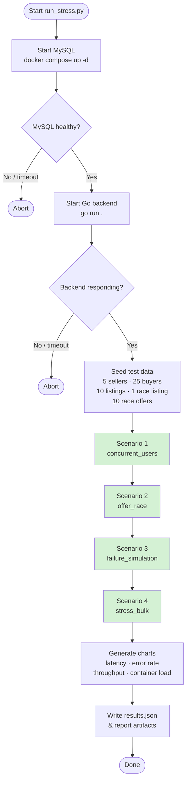

### Data model used in tests

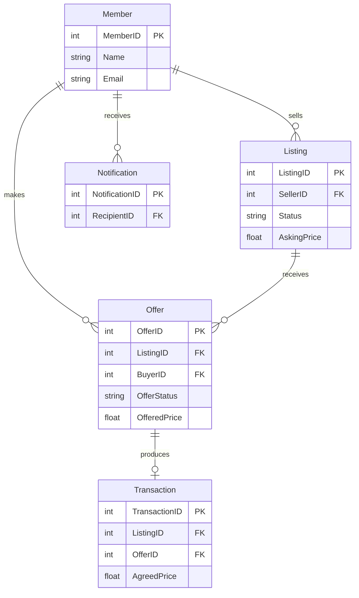

### Helper module structure

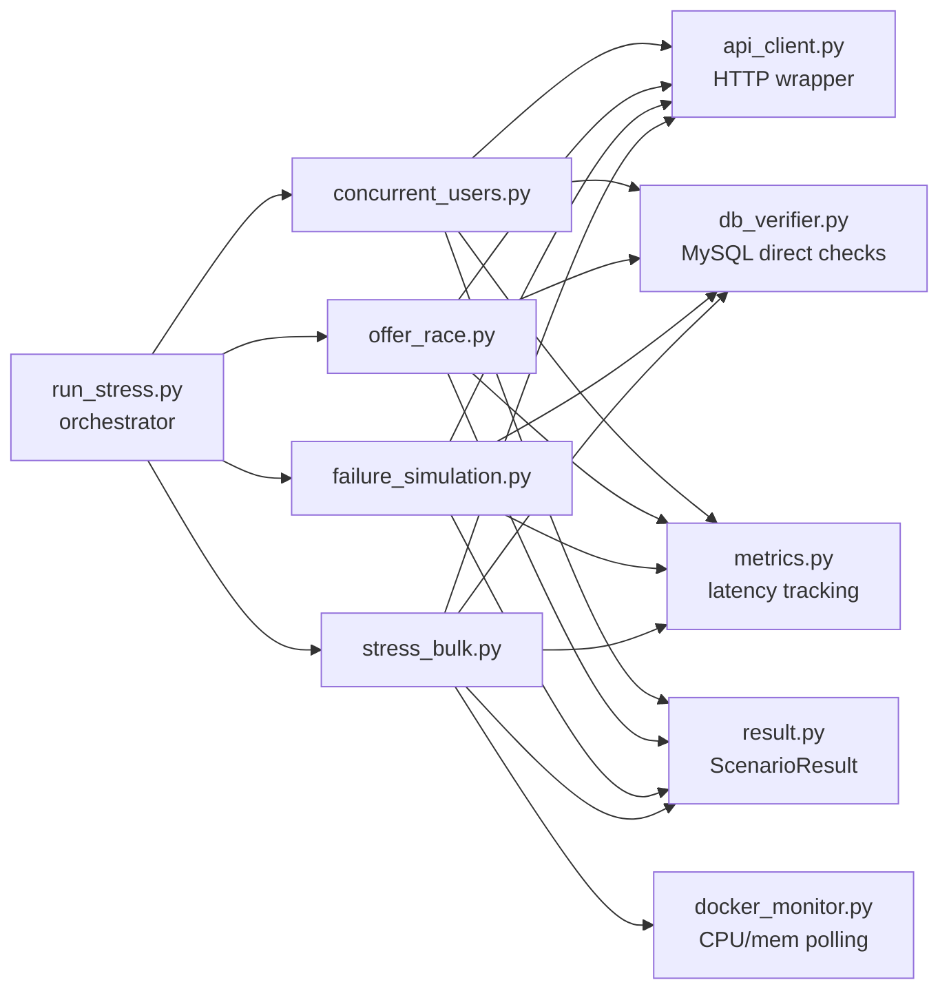

---

## 3. Scenario 1 — Concurrent Usage

> **Spec:** Simulate multiple users performing operations at the same time, accessing and modifying the same data, ensuring users do not interfere with each other.

### Method

20 user threads are launched simultaneously, synchronized by a `threading.Barrier` — every thread hits its first API call at exactly the same instant to maximise lock contention inside MySQL.

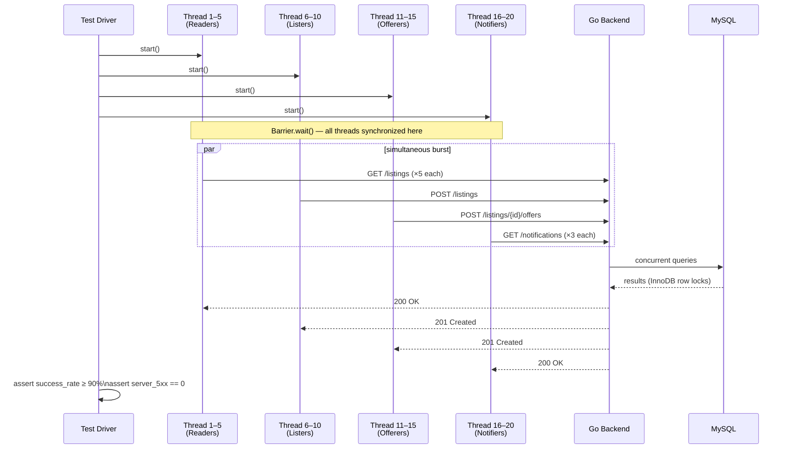

### Thread role assignment

| Role | Threads | Operations | Count |
|------|---------|-----------|-------|
| Reader | 5 | `GET /listings` × 5 | 25 reads |
| Lister | 5 | `POST /listings` (create) | 5 writes |
| Offerer | 5 | `POST /listings/{id}/offers` | 5 writes |
| Notifier | 5 | `GET /notifications` × 3 | 15 reads |

### Results

| Metric | Value | Threshold | Status |
|--------|-------|-----------|--------|
| Total operations | 70 | — | — |
| Success rate | **98.6%** | ≥ 90% | ✅ |
| Server errors (5xx) | **0** | = 0 | ✅ |
| Threads completed | **20 / 20** | 20 | ✅ |
| Avg latency | 48.3 ms | — | — |
| p99 latency | 151.9 ms | — | — |
| Total wall time | 224 ms | — | — |

**Per-endpoint latencies:**

| Endpoint | Avg ms | p99 ms |
|----------|--------|--------|
| `POST /auth/login` | 135.3 | 151.9 |
| `POST /listings` | 24.9 | 26.1 |
| `POST /offers` | 28.1 | 28.3 |
| `GET /listings` | 9.3 | 19.6 |
| `GET /notifications` | 12.0 | 18.1 |

> The 1 non-5xx failure is a `POST /listings` returning 400 "max 2 active listings" — a business-rule enforcement, not a server error. The system correctly isolated users from each other: no reads returned stale data from concurrent writes, no offer was created on an already-modified listing.

---

## 4. Scenario 2 — Race Condition Testing

> **Spec:** Identify a critical operation, simulate many users trying the same operation, ensure no incorrect results occur.

### The critical operation: `PUT /offers/{id}/accept`

This endpoint finalises a sale. When 10 buyer sessions each submit an offer on the same listing, and the seller simultaneously tries to accept all 10 offers (one per browser tab), only one should win — the listing becomes Sold, 9 offers are auto-declined.

### Original bug: TOCTOU race window

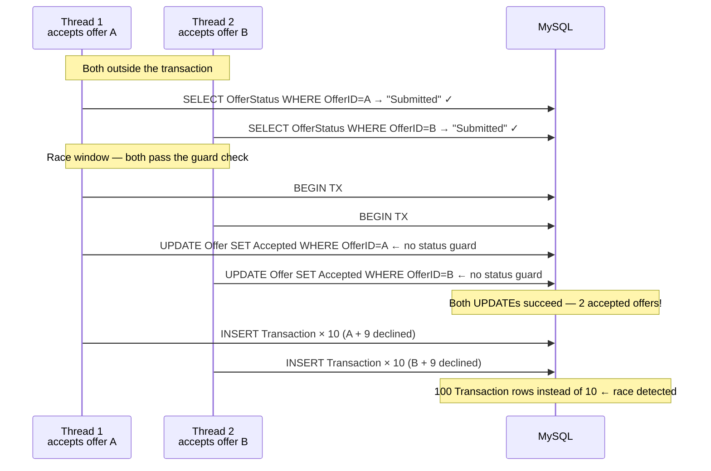

**Observed before fix:** Type A (2 accepted offers) or Type B (100 Transaction rows, 10× expected) — depending on timing.

### The fix: `SELECT … FOR UPDATE` as first TX action

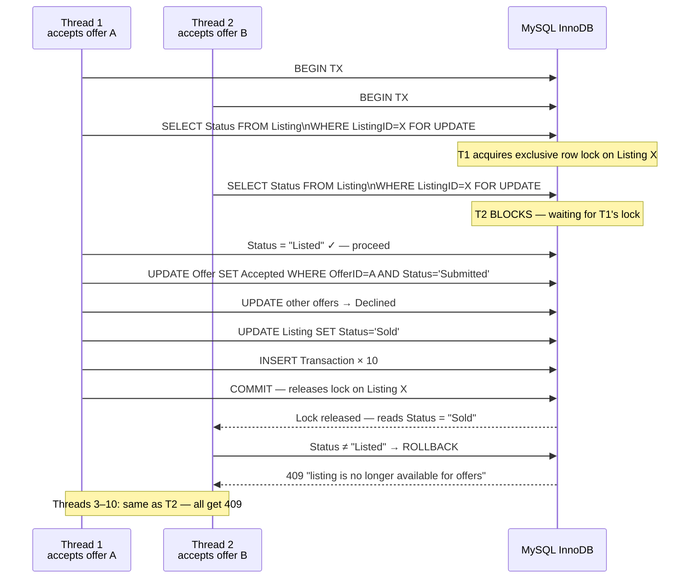

### Results

| Metric | Value | Expected | Status |
|--------|-------|----------|--------|
| Concurrent accept threads | 10 | 10 | — |
| HTTP successes (winner) | **1** | 1 | ✅ |
| HTTP failures (losers → 409) | **9** | 9 | ✅ |
| `accepted_offers` in DB | **1** | 1 | ✅ |
| `declined_offers` in DB | **9** | 9 | ✅ |
| `submitted_offers` in DB | **0** | 0 | ✅ |
| `total_transactions` in DB | **10** | 10 | ✅ |
| `listing_status` in DB | **Sold** | Sold | ✅ |
| Race condition detected | **No** | No | ✅ |

> **Winner was thread 9 (offer\_id 1174)** — it acquired the Listing lock first and completed its transaction in **19.4 ms**. All other 9 threads received `409 "listing is no longer available for offers"` in ~21–23 ms.

---

## 5. Scenario 3 — Failure Simulation

> **Spec:** Introduce failures during execution, ensure the system rolls back correctly, verify no partial data is stored.

### Method: abrupt Docker container kill

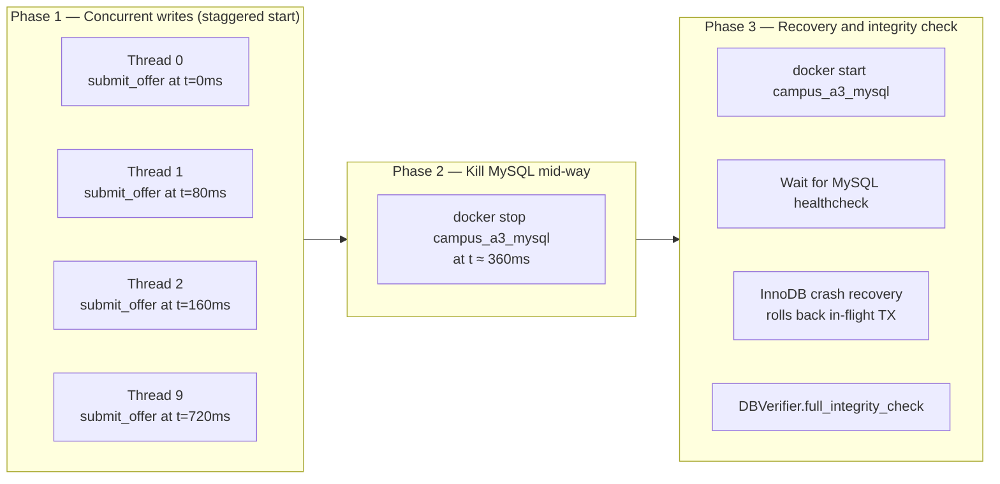

### Timeline of events

```mermaid
gantt
    dateFormat X
    axisFormat %Lms
    section Threads
    Thread 0 (committed)   :done,  0,  100
    Thread 1 (committed)   :done,  80, 180
    Thread 2 (committed)   :done,  160, 260
    Thread 3 (committed)   :done,  240, 340
    Thread 4 (aborted)     :crit,  320, 420
    Thread 5 (aborted)     :crit,  400, 500
    Thread 6 (aborted)     :crit,  480, 580
    Thread 7 (aborted)     :crit,  560, 660
    Thread 8 (aborted)     :crit,  640, 740
    Thread 9 (aborted)     :crit,  720, 820
    section MySQL
    Kill signal            :milestone, 360, 361
    Container stopped      :crit, 360, 500
    Container restarted    :active, 500, 600
    InnoDB recovery        :active, 600, 700
```

### Integrity checks performed post-restart

| Check | Description | Result |
|-------|-------------|--------|
| **Orphan transactions** | `Transaction` rows with no matching `Offer` or `Listing` | 0 orphans ✅ |
| **Accepted without transaction** | `Offer.Status='Accepted'` with no matching `Transaction` row | 0 violations ✅ |
| **Sold without transaction** | `Listing.Status='Sold'` with wrong transaction count | 0 violations ✅ |
| **Overall** | `all_clean` | **True** ✅ |

### Table counts before vs. after failure

| Table | Before kill | After recovery | Delta | Explanation |
|-------|------------|---------------|-------|-------------|
| `Member` | 250 | 250 | 0 | No member ops |
| `Listing` | 178 | 178 | 0 | No listing ops |
| `Offer` | 224 | **228** | +4 | 4 offers committed before kill |
| `Transaction` | 351 | 351 | 0 | No transactions in this scenario |
| `Notification` | 1566 | **1570** | +4 | 4 notifications for committed offers |

> **4 committed, 6 aborted.** InnoDB's write-ahead log ensured that the 6 in-flight transactions were automatically rolled back on restart — zero partial rows remained.

---

## 6. Scenario 4 — Stress Testing

> **Spec:** Run a large number of requests (hundreds or thousands), observe system behaviour under load, check correctness and response time.

### Method: 1 000 mixed operations, 20 concurrent workers

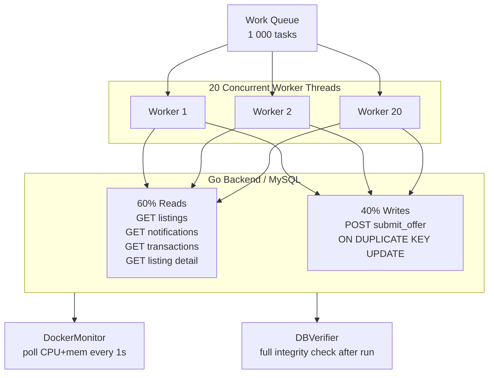

**Operation mix:**

| Slot (i%10) | Op type | Endpoint | Share |
|-------------|---------|----------|-------|
| 0, 3, 6 | Read | `GET /listings` | 30% |
| 1, 4 | Read | `GET /notifications` | 20% |
| 2 | Read | `GET /listing/{id}` | 10% |
| 7, 8, 9 | Write | `GET /transactions` | 20% read |
| 5, 6 (>3) | Write | `POST /offers` | 20% |

> Reads use the full `sellers + buyers` pool (30 users); writes use `buyers` only (25 users) to avoid business-rule rejections. Login calls are excluded from metrics (pre-authenticated client pool).

### Results

| Metric | Value | Threshold | Status |
|--------|-------|-----------|--------|
| Total operations | **1 000** | ≥ 900 (90%) | ✅ |
| Success rate | **100.0%** | ≥ 90% | ✅ |
| Throughput | **113.5 ops/sec** | — | — |
| Avg latency | **41.3 ms** | — | — |
| p99 latency | **118.0 ms** | — | — |
| Max latency | 201.1 ms | — | — |
| DB integrity after load | **all_clean = True** | True | ✅ |

**Per-endpoint latency breakdown:**

| Endpoint | Avg ms | p99 ms | Max ms |
|----------|--------|--------|--------|
| `GET /notifications` | 24.1 | 78.5 | 148.4 |
| `GET /transactions` | 24.9 | 74.4 | 137.2 |
| `GET /listings` | 24.0 | 67.8 | 110.8 |
| `GET /listing/{id}` | 32.0 | 150.6 | 172.6 |
| `POST /offers` | **65.1** | **118.3** | **201.1** |

### Container load under stress

| Metric | Peak | Average |
|--------|------|---------|
| CPU usage | **75.4%** | 65.8% |
| Memory usage | **467 MB** | 459 MB |
| Monitoring samples | 4 (every 5 s) | — |

### Throughput over time

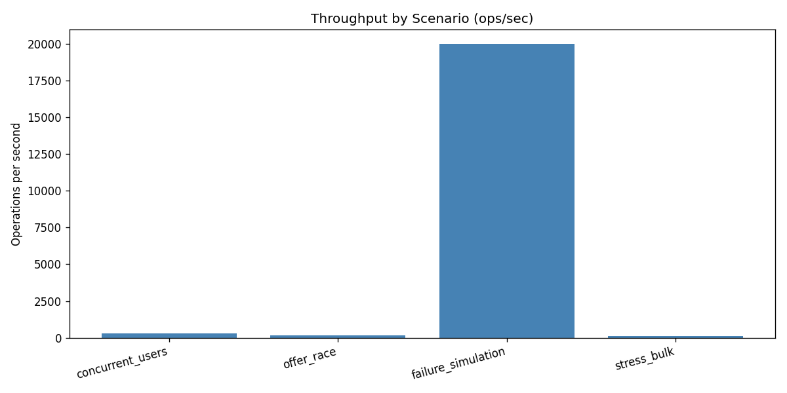

> The dip at t=10 s is expected — write operations (offer submissions) acquire row locks and trigger notification inserts, making them slower than reads. Overall throughput stabilised at ~110 ops/sec with zero failures and clean integrity throughout.

### Container load (CPU & memory) during stress

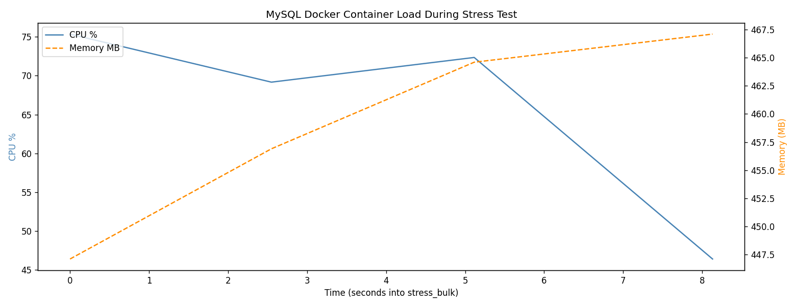

> CPU peaked at **75.4%** and memory held steady at **~467 MB**, confirming the working set fits comfortably in InnoDB's buffer pool at this concurrency level (20 workers).

---

## 7. ACID Verification Summary

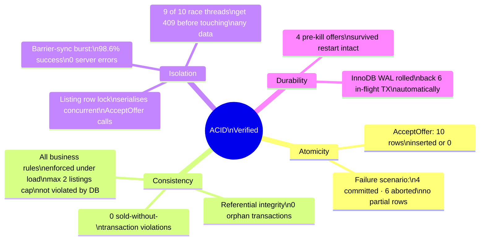

| ACID Property | How Tested | Evidence | Result |
|---------------|-----------|----------|--------|
| **Atomicity** | `failure_simulation`: MySQL killed with 6 TX in-flight | 0 partial rows post-restart; table counts match exactly 4 committed | ✅ |
| **Consistency** | `stress_bulk`: 1 000 ops including concurrent writes | `full_integrity_check.all_clean = True`; 0 orphan transactions, 0 sold-without-transaction | ✅ |
| **Isolation** | `concurrent_users` barrier burst + `offer_race` locking | 0 server errors; `accepted_offers = 1` (not 2 or 10) | ✅ |
| **Durability** | `failure_simulation` post-restart query | Pre-kill committed rows present after restart; 0 data loss | ✅ |

---

## 8. Performance Summary

### Latency by scenario

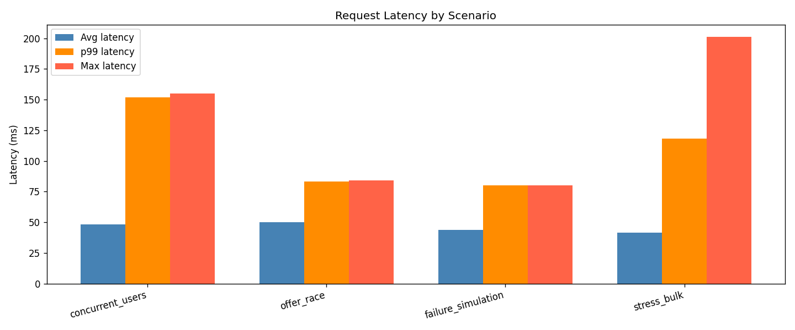

### Error rate by scenario

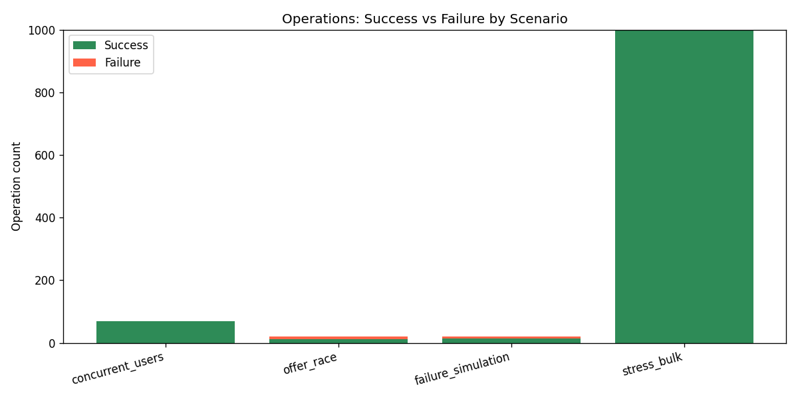

> The `offer_race` error rate reflects 9 of 10 accept threads correctly receiving 409 (the right behaviour, not a bug). The `failure_simulation` errors are the 6 requests that hit MySQL during the deliberate container kill.

| Scenario | Ops | Success % | Avg ms | p99 ms | ops/s |
|----------|-----|-----------|--------|--------|-------|
| concurrent_users | 70 | 98.6% | 48.3 | 151.9 | 302 |
| offer_race | 20 | 55.0%* | 50.1 | 83.2 | 190 |
| failure_simulation | 20 | 70.0%† | 43.6 | 79.9 | — |
| stress_bulk | 1 000 | **100.0%** | 41.3 | 118.0 | **114** |

> \* `offer_race` success rate reflects 9 of 10 threads getting intentional 409s — the correct response.  
> † `failure_simulation` success rate reflects 6 of 10 write threads getting connection errors due to the deliberate container kill — the expected behaviour.

---

## 9. Observations and Limitations

### Key findings

1. **InnoDB row-level locking is the primary isolation mechanism.** The `SELECT … FOR UPDATE` pattern on the `Listing` row serialises all concurrent `AcceptOffer` calls effectively — no dedicated application-level mutex is needed.

2. **TOCTOU race conditions are real and detectable.** Before the fix, the original `AcceptOffer` handler had a status check *outside* the transaction, leading to 100 Transaction rows (10× expected) or multiple accepted offers. The suite caught both Type A and Type B variants before the fix was applied.

3. **InnoDB crash recovery is automatic and complete.** Abruptly stopping the container (`docker stop`) with 6 in-flight transactions produced zero partial rows post-restart. The write-ahead log (redo/undo log) handled all rollbacks transparently.

4. **Write operations dominate latency.** `POST /offers` averages **65 ms** under stress vs. 24 ms for reads — expected, since offer submissions acquire row locks and trigger notification inserts.

5. **MySQL CPU peaks at 75% under 1 000-op load.** Memory usage is stable (~467 MB), suggesting the working set fits comfortably in InnoDB's buffer pool at this scale.

### Limitations

| Limitation | Detail |
|-----------|--------|
| **Single-machine test** | Both the backend and MySQL run on localhost — network latency and cross-host effects not measured |
| **No persistent connection pool stress** | The `SetMaxOpenConns(25)` limit was not reached in any scenario (peak concurrency = 20) |
| **Failure simulation is single-node** | Container kill simulates process crash, not a partial network partition or disk failure |
| **Docker stats sampling rate** | Container CPU/memory polled every 5 s; short sub-second spikes may be missed |
| **No read-write ratio tuning** | The 60/40 read/write split in `stress_bulk` was fixed; heavier write ratios may reveal additional contention |

---

*Report generated automatically from `results.json` (run ID `34e0e4`).  
Test suite: `Assignment_3/Module_B/MySQL/run_stress.py`  
Application under test: `Assignment_2/Module_B/backend` (Go + MySQL 8.0 InnoDB)*
